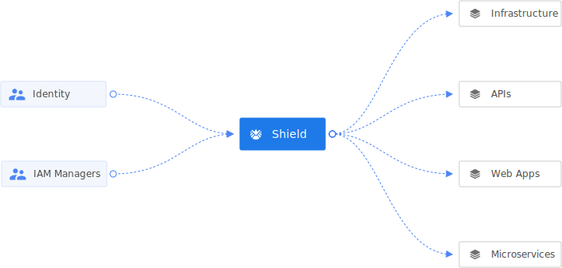

# Shield


[](LICENSE)
[](Version)
[](https://coveralls.io/github/odpf/shield?branch=main)

Shield is a cloud native role-based authorization aware reverse-proxy service. With Shield, you can assign roles to users or groups of users to configure policies that determine whether a particular user has the ability to perform a certain action on a given resource.

<p align="center"></p>

## Key Features
Discover why users choose Shield as their authorization proxy

- **Policy Management**: Policies help you assign various roles to users/groups that determine their access to various resources
- **Group Management**: Group is nothing but another word for team. Shield provides APIs to add/remove users to/from a group, fetch list of users in a group along with their roles in the group, and fetch list of groups a user is part of.
- **Activity Logs**: Shield has APIs that store and retrieve all the access related logs. You can see who added/removed a user to/from group in these logs.
- **Reverse Proxy**: In addition to configuring access management, you can also use Shield as a reverse proxy to directly protect your endpoints by configuring appropriate permissions for them.
- **Google IAP**: Shield also utilizes Google IAP as an authentication mechanism. So if your services are behind a Google IAP, Shield will seemlessly integrate with it.
- **Runtime**: Shield can run inside containers or VMs in a fully managed runtime environment like Kubernetes. Shield also depends on a Postgres server to store data.

## How can I get started?

- [Guides](guides/overview.md) provide guidance on how to use Shield and configure it to your needs
- [Concepts](concepts/casbin.md) descibe the primary concepts and architecture behind Shield
- [Reference](reference/api.md) contains the list of all the APIs that Shield exposes
- [Contributing](contribute/contribution.md) contains resources for anyone who wants to contribute to Shield


## Installation

Install Shield on macOS, Windows, Linux, OpenBSD, FreeBSD, and on any machine.

#### Binary (Cross-platform)

Download the appropriate version for your platform from [releases](https://github.com/odpf/shield/releases) page. Once downloaded, the binary can be run from anywhere.
You don’t need to install it into a global location. This works well for shared hosts and other systems where you don’t have a privileged account.
Ideally, you should install it somewhere in your PATH for easy use. `/usr/local/bin` is the most probable location.

#### Homebrew

```sh
# Install shield (requires homebrew installed)
$ brew install odpf/taps/shield

# Upgrade shield (requires homebrew installed)
$ brew upgrade shield

# Check for installed shield version
$ shield version
```

## Usage

Shield CLI is fully featured but simple to use, even for those who have very limited experience working from the command line. Run `shield --help` to see list of all available commands and instructions to use.

```
$ shield --help
Identiy made simple.

USAGE
  shield <command> <subcommand> [flags]

CORE COMMANDS
  migrate     Run database migrations
  serve       Run shield server

ADDITIONAL COMMANDS
  completion  generate the autocompletion script for the specified shell
  config      Manage client configuration settings
  help        Help about any command
  version     Print version information

FLAGS
  --help   Show help for command

ENVIRONMENT VARIABLES
  See 'shield help environment' for the list of supported environment variables.

LEARN MORE
  Use 'shield <command> <subcommand> --help' for more information about a command.
  Read the manual at https://odpf.github.io/shield/

FEEDBACK
  Open an issue here https://github.com/odpf/shield/issues
```

## Running locally

<details>
  <summary>Dependencies:</summary>

    - Git
    - Go 1.17 or above
    - PostgreSQL 13.2 or above

</details>

```sh
# Clone the repo
$ git clone git@github.com:odpf/shield.git

# Install all the golang dependencies
$ make install

# Check all build comamnds available
$ make help

# Build meteor binary file
$ make build

# Init config
$ cp app/config.yaml config.yaml
$ ./shield config init

# Run database migrations
$ ./shield migrate

# Start shield server
$ ./shield serve
```

## Running tests

```sh
# Running all unit tests
$ make test

# Print code coverage
$ make coverage
```

## Contribute

Development of Shield happens in the open on GitHub, and we are grateful to the community for contributing bugfixes and
improvements. Read below to learn how you can take part in improving Shield.

Read our [contributing guide](https://odpf.github.io/shield/docs/contribute/contribution) to learn about our development process, how to propose
bugfixes and improvements, and how to build and test your changes to Shield.

To help you get your feet wet and get you familiar with our contribution process, we have a list of
[good first issues](https://github.com/odpf/shield/labels/good%20first%20issue) that contain bugs which have a relatively
limited scope. This is a great place to get started.

This project exists thanks to all the [contributors](https://github.com/odpf/shield/graphs/contributors).

## License

Shield is [Apache 2.0](LICENSE) licensed.
