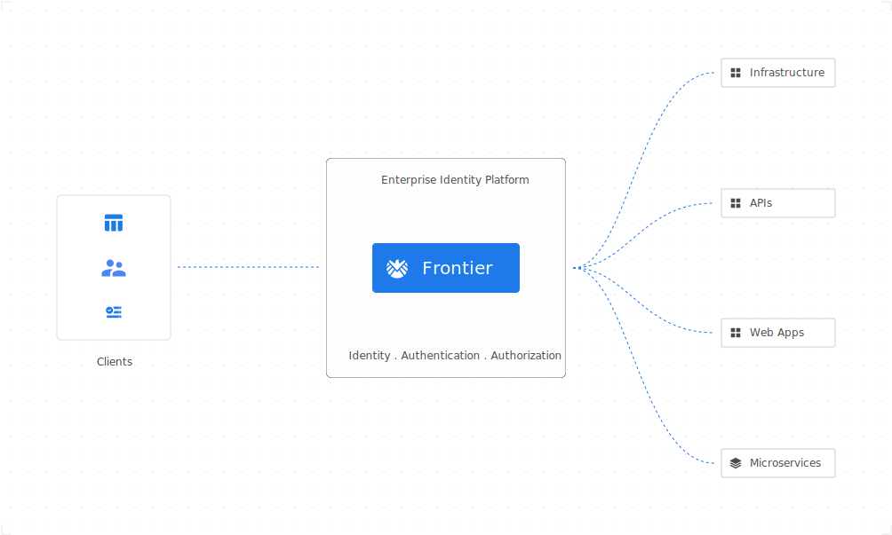

# Frontier


[](LICENSE)
[](Version)
[](https://coveralls.io/github/raystack/frontier?branch=main)

Frontier is an identity and access management tool designed to help organizations secure their systems and data. With Frontier, you can manage user authentication and authorization across all your applications and services, ensuring that only authorized users have access to your valuable resources.

<p align="center"></p>

## Key Features

Discover why users choose Frontier as their authorization server

- **User management** Create and manage user accounts for all your applications and services.
- **Organization management** Manage multiple tenants, each with their own set of users, applications, and services.
- **Project management** Organize your resources into projects and manage access permissions for each project.
- **Group management** Create and manage groups of users with different access levels across projects and applications.
- **Authentication** Multiple authentication strategies like Email OTP, Social Login for human users and API keys, RSA JWT based for machine users.
- **Authorization** Role based access control with policies to bind a user to its access level.
- **Billing management** Manage billing and subscriptions for your users.
- **Audit** Audit all user activity and access related logs.
- **Reporting** Generate reports on user activity and access levels.

## How can I get started?

- [Introduction](docs/docs/introduction.md) provide guidance on how to use Frontier and configure it to your needs
- [Concepts](docs/docs/concepts/architecture.md) descibe the primary concepts and architecture behind Frontier
- [Reference](docs/docs/reference/api-definitions.md) contains the list of all the APIs that Frontier exposes
- [Contributing](docs/docs/contribution/contribute.md) contains resources for anyone who wants to contribute to Frontier

## Installation

Install Frontier on macOS, Windows, Linux, OpenBSD, FreeBSD, and on any machine. Refer this for [installations](https://raystack.github.io/frontier/docs/installation).

#### Binary (Cross-platform)

Download the appropriate version for your platform from [releases](https://github.com/raystack/frontier/releases) page. Once downloaded, the binary can be run from anywhere.
You don’t need to install it into a global location. This works well for shared hosts and other systems where you don’t have a privileged account.
Ideally, you should install it somewhere in your PATH for easy use. `/usr/local/bin` is the most probable location.

#### macOS

`frontier` is available via a Homebrew Tap, and as downloadable binary from the [releases](https://github.com/raystack/frontier/releases/latest) page:

```sh
brew install raystack/tap/frontier
```

To upgrade to the latest version:

```
brew upgrade frontier
```

#### Linux

`frontier` is available as downloadable binaries from the [releases](https://github.com/raystack/frontier/releases/latest) page. Download the `.deb` or `.rpm` from the releases page and install with `sudo dpkg -i` and `sudo rpm -i` respectively.

#### Windows

`frontier` is available via [scoop](https://scoop.sh/), and as a downloadable binary from the [releases](https://github.com/raystack/frontier/releases/latest) page:

```
scoop bucket add frontier https://github.com/raystack/scoop-bucket.git
```

To upgrade to the latest version:

```
scoop update frontier
```

#### Docker

We provide ready to use Docker container images. To pull the latest image:

```
docker pull raystack/frontier:latest
```

To pull a specific version:

```
docker pull raystack/frontier:0.8.19
```

## Usage

Frontier is purely API-driven. It is very easy to get started with Frontier. It provides CLI, HTTP and GRPC APIs for simpler developer experience.

#### CLI

Frontier CLI is fully featured and simple to use, even for those who have very limited experience working from the command line. Run `frontier --help` to see list of all available commands and instructions to use.

List of commands

```
frontier --help
```

Print command reference

```sh
frontier reference
```

#### API

Frontier provides a fully-featured GRPC and HTTP API to interact with Frontier server. Both APIs adheres to a set of standards that are rigidly followed. Please refer to [proton](https://github.com/raystack/proton/tree/main/raystack/frontier/v1beta1) for GRPC API definitions.

## Contribute

Development of Frontier happens on GitHub, and we are grateful to the community for contributing bugfixes and
improvements.

Read our [contribution guide](https://raystack.github.io/frontier/docs/contribute/contribution) to learn about our development process, how to propose
bugfixes and improvements, and how to build and test your changes to Frontier.

To help you get your feet wet and get you familiar with our contribution process, we have a list of
[good first issues](https://github.com/raystack/frontier/labels/good%20first%20issue) that contain bugs which have a relatively
limited scope. This is a great place to get started.

This project exists thanks to all the [contributors](https://github.com/raystack/frontier/graphs/contributors).

## License

Frontier is [Apache 2.0](LICENSE) licensed.
