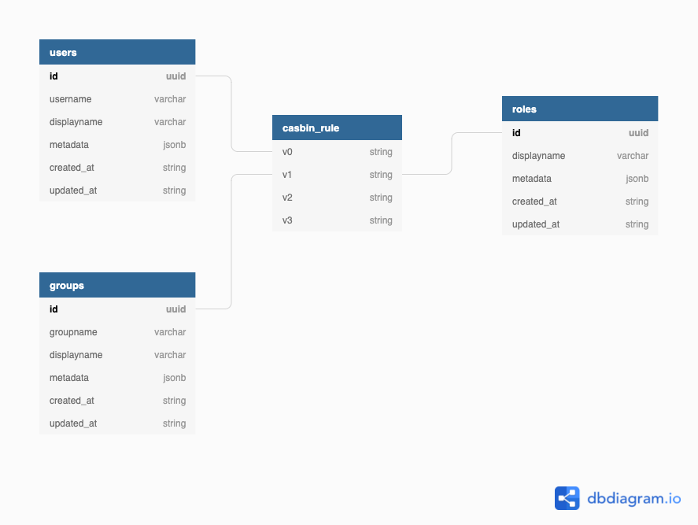

# Schema

The following section describes the database schema for shield.  Shield uses the Postgres database for storing policies, Casbin rules, and users. 

## Users

Users table stores details about all registered users.

| Column Name | Column Type | Foreign Key | Notes |
| :--- | :--- | :--- | :--- |
| id | uuid | One to many mapping with v0 column of casbin\_rule | unique |
| username | varchar |  | unique |
| displayname | varchar |  |  |
| metadata | jsonb |  | can contain any extra metadata information |
| created\_at | string |  | data/time when the record was created |
| updated\_at | string |  | data/time when the record was last updated |

## Groups

Groups table stores all the groups users belong to.

| Column name | Column type | Foreign key | Notes |
| :--- | :--- | :--- | :--- |
| id | uuid | one to many map with v1 column of casbin\_rule | unique |
| groupname | varchar |  | unique |
| displayname | varchar |  |  |
| metadata | jsonb |  | can contain any extra metadata information |
| created\_at | string |  | data/time when the record was created |
| updated\_at | string |  | data/time when the record was last updated |

## Roles

Roles table is used to store all the roles that can be assigned to users. 

| Column Name | Column Type | Foreign key | Notes |
| :--- | :--- | :--- | :--- |
| id | uuid | one to many map with v1 column of casbin\_rule | unique |
| displayname | varchar |  |  |
| metadata | jsonb |  | can contain any extra metadata information |
| created\_at | string |  | data/time when the record was created |
| updated\_at | string |  | data/time when the record was last updated |

## casbin\_rule

 This table serves as the [adapter](https://casbin.org/docs/en/adapters) storage for all Casbin policies. 

| Column Name | Column Type | Foreign key | Notes |
| :--- | :--- | :--- | :--- |
| v0 | string | maps with user id |  |
| v1 | string | maps with role id, group id |  |
| v2 | string |  |  |
| v3 | string |  |  |

