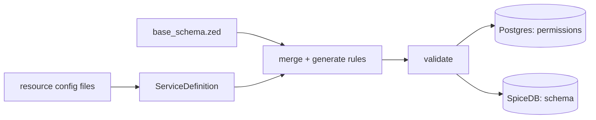

# Custom Resources and Role Inheritance

Frontier lets services register their own resource types (for example `compute/machine`).
Once registered, Frontier can answer permission checks on those resources the same way it
does for built-in types like projects and organizations.

This page explains three things:

1. How a custom resource type is loaded into Frontier.
2. What permission rules Frontier generates for it, and which role each action ends up with.
3. Why a role can **list** a resource but still fail to **get** a single one. This is the part
   that surprises people most, so it has its own section.

---

## How custom resources are loaded

A custom resource type is described in a small config file. Each file lists a namespace and
the actions (permissions) that namespace supports. Here is the built-in `compute/machine`
example from `resources_config/compute_machine.yml`:

```yaml
permissions:
  - name: get
    namespace: compute/machine
  - name: create
    namespace: compute/machine
  - name: update
    namespace: compute/machine
  - name: delete
    namespace: compute/machine
```

A namespace has two parts joined by a slash: `service/resource`. So `compute/machine` is the
`machine` resource in the `compute` service.

At startup Frontier runs a bootstrap step (`MigrateSchema`) that does the following:

1. Reads every resource config file into a `ServiceDefinition` (the list of namespaces and
   their actions).
2. Loads the base SpiceDB schema (`base_schema.zed`), which defines users, organizations,
   projects, roles, and role bindings.
3. Generates extra rules for each custom action and merges them into the base schema.
4. Validates the merged schema, writes the permission list to Postgres, and writes the full
   schema to SpiceDB.

This step is idempotent. It runs on every boot and recreates the same schema, so adding a new
resource config and restarting is all it takes to register a new type.



---

## What rules get generated

For **each** action on a custom resource, the generator adds a rule in four places. The
action name is flattened into a single slug: namespace `compute/machine` with action `get`
becomes `compute_machine_get`.

Below are the rules generated for the `get` action on `compute/machine`. The `+` sign means
"or", so a principal passes the check if **any** line matches.

**On the resource itself** — who can `get` one machine. The resource definition is named
after its namespace, so the check runs against `compute/machine:<id>`:

```
compute/machine#get = owner
                   + project->app_project_administer
                   + project->compute_machine_get
                   + granted->compute_machine_get
```

**On the organization** — the org-wide version of the action:

```
app/organization#compute_machine_get = owner
                                     + platform->superuser
                                     + granted->app_organization_administer
                                     + granted->compute_machine_get
                                     + pat_granted->app_project_administer
                                     + pat_granted->compute_machine_get
```

**On the project** — the project-wide version, which pulls from the org:

```
app/project#compute_machine_get = org->compute_machine_get
                               + granted->app_project_administer
                               + granted->compute_machine_get
```

**On the role and role binding** — so a role can carry the action:

```
app/rolebinding#compute_machine_get = bearer & role->compute_machine_get
app/role: relation compute_machine_get: app/user:* | app/serviceuser:* | app/pat:*
```

When a resource is created, Frontier also writes an `owner` relation to the creator and a
`project` relation linking the resource to its project. Those two links are what make the
arrows above resolve.

---

## Which action goes to which role

There are two layers, and it helps to keep them apart:

- **The schema** (generated above) fixes the *paths* a check can travel.
- **The roles** decide *which permissions a principal actually holds*.

A principal gets access to a custom action only when both line up. Here is who can `get` a
custom resource and how each one reaches it.

| Who | How they reach `get` | Granted automatically? |
| --- | --- | --- |
| Resource owner (creator) | `owner` arrow on the resource | Yes, on create |
| Platform admin | `platform->superuser` | Yes |
| Org Owner role (`app_organization_administer`) | org rule's `granted->app_organization_administer` | **Yes** — every custom action, for free |
| Org `owner` relation | org rule's `owner` arrow | Yes |
| A project role that lists the action | `project->compute_machine_get` -> `granted->compute_machine_get` | Only if the role lists it |
| A project admin role (`app_project_administer`) | `project->compute_machine_get` -> `granted->app_project_administer` | Only if the role grants project admin |
| A direct grant on the resource | `granted->compute_machine_get` on the resource | Only if a policy is set on the resource |

The key point about the **Org Owner** role: the org-level rule hardcodes
`granted->app_organization_administer`. So whoever holds the Owner role on an organization can
perform **every** custom action on **every** resource in that org, without any project or
resource grant. This is on purpose.

The **Org Admin** role (`app_organization_manager`) is different. Its permissions are:

```
app_organization_update, app_organization_get, app_organization_projectcreate,
app_organization_projectlist, app_organization_groupcreate, app_organization_grouplist,
app_organization_serviceusermanage, app_project_get, app_project_update
```

None of these appears anywhere in the custom-action rules above. So the Org Admin role does
**not** get custom resource actions through org inheritance. To act on a custom resource, an
Admin would need a project role that lists the action, a project admin role, or a direct grant
on the resource.

---

## Creating resources: a special case (best practice)

`create` is not like `get`, `update`, or `delete`. You check those against a resource that
already exists. But you check `create` *before* the resource exists, so there is no
`compute/machine:<id>` to check against.

The generator still emits a `compute/machine#create` rule on the resource, but it is not useful
for a real create. It would need a resource id you do not have yet. So in practice that rule is
dead.

The right model is to treat "create" as a capability on the **container** — the project — and
check it against the project id, with the caller as the subject:

```
Check(
  subject    = app/user:<userid>,            # the authenticated caller
  permission = user_project_createcomputemachine,
  resource   = app/project:<project_id>,     # the container — it already exists
)
```

### Why the permission can't live in `app/project`

It would read most naturally as `app/project:createcomputemachine`. That does not work. At boot,
bootstrap drops any permission whose namespace starts with `app` (the
`filterDefaultAppNamespacePermissions` step). The `app/*` types belong to the base schema and are
rebuilt on every start, so config is not allowed to add permissions to them. A
`app/project:createcomputemachine` entry in a config file is silently ignored.

So the create capability gets its own namespace. By convention this is `user/project` — read it
as "something a user can do inside a project". The generator then mirrors it onto the project as
`app/project#user_project_createcomputemachine`, and that mirrored permission is what you check.

> **Don't confuse two things.** A role *can* list an `app/project` permission — for example a
> Project Viewer role with `app/project:get` in its `permissions`. That is allowed because `get`
> already exists on `app/project` in the base schema; the role is pointing at an existing
> permission. Filtering only blocks *defining* a new permission under `app/*` in the
> `permissions:` section. So you can reference `app/project:get`, but you cannot create
> `app/project:createcomputemachine`. That is why the create action is defined under
> `user/project` and only then granted by a project role.

> Note: the permission **slug** follows its namespace, so it is `user_project_createcomputemachine`,
> not `app_project_createcomputemachine`. The only way to get a bare `app/project` permission is to
> edit `base_schema.zed`, which is a code change, not config — and it does not scale to add one per
> resource. Use the `user/project` namespace instead.

### Config

Register the create action under `user/project`, then grant it to a project-scoped role such as
the built-in Project Owner:

```yaml
permissions:
  # get / update / delete stay on the resource itself
  - name: get
    namespace: compute/machine
  - name: update
    namespace: compute/machine
  - name: delete
    namespace: compute/machine
  # create lives on the container, via the user/project namespace
  - name: createcomputemachine
    namespace: user/project          # NOT app/project — that would be filtered out

roles:
  - name: app_project_owner          # extend the built-in Project Owner role
    title: Project Owner
    scopes:
      - app/project
    permissions:
      - user/project:createcomputemachine
```

This does three things:

1. Defines `user_project_createcomputemachine` and mirrors it onto `app/project`.
2. Grants it to the Project Owner role, which is scoped to `app/project`.
3. Lets an owner of a project pass the create check shown above, because
   `app/project#user_project_createcomputemachine` resolves through `granted->...` on the project.

### Rule of thumb

- Put `get`, `update`, `delete` (and other actions on an existing item) under the resource
  namespace, for example `compute/machine`.
- Put `create` under `user/project`, and grant it to a project role.
- Check `create` against `app/project:<project_id>`, never against the resource.

This keeps every create check anchored on the project and avoids the dead resource-level
`create` rule.

---

## Listing vs getting: why a role can see a list but not open an item

This is the part worth reading twice.

Frontier checks **list** and **get** with two different engines, and they accept different
permissions. A role can pass one and fail the other.

### Getting one resource

A `get` is a real SpiceDB check on the resource (for example `compute/machine#get`). It walks
the chain above:

```
compute/machine#get
  -> project->compute_machine_get
       -> org->compute_machine_get
            -> granted->app_organization_administer   (Org Owner)
             + granted->compute_machine_get            (a role that lists the action)
```

At the org step, the only org-level keys that open the door are
`app_organization_administer` or a literal `compute_machine_get` grant. The Org Admin role has
neither, so its `get` is denied.

### Listing resources

Listing usually starts by asking "which projects can this user see?" That question is answered
from Postgres policy rows, not from a per-resource SpiceDB check. The service treats a broader
set of org permissions as proof that a user can see every project in the org:

```
OrganizationProjectInheritPerms = { app_organization_administer, app_project_get, app_project_administer }
```

The Org Admin role holds `app_project_get`, which is in that set. So when a caller lists
projects with inheritance turned on, the Admin sees **every project in the org** — and a
service that lists its resources per visible project will then list every resource too.

### The result

For the Org Admin role:

| Operation | Engine | Org-level key it accepts | Admin passes? |
| --- | --- | --- | --- |
| List projects in org | Postgres policy check | `app_project_get` (among others) | Yes |
| List resources (per visible project) | Postgres policy check | `app_project_get` (among others) | Yes |
| Get one resource | SpiceDB resource check | `app_organization_administer` or the literal action grant | No |

So an Org Admin can end up seeing a full list of resources where every item returns "permission
denied" when opened. The fix is a data change or a schema change:

- **Data change**: add the resource action (for example `compute_machine_get`) to a role the
  user holds — at the org level (so the org rule's `granted->compute_machine_get` matches) or
  at the project level.
- **Schema change**: change the generator so the org-level rule for custom actions also accepts
  `app_project_get`. This is broader and affects every custom resource, so weigh it carefully.

---

## Quick reference

- A custom resource is registered from a config file listing a `service/resource` namespace and
  its actions.
- Bootstrap merges generated rules into the base schema on every boot and writes them to SpiceDB.
- The **resource owner**, **platform admin**, and **Org Owner** can always perform every action
  on a resource. Project and direct grants depend on the roles in use.
- **Listing** accepts `app_project_get` as org-wide visibility; **getting** does not. That gap is
  why a role can list resources it cannot open.
