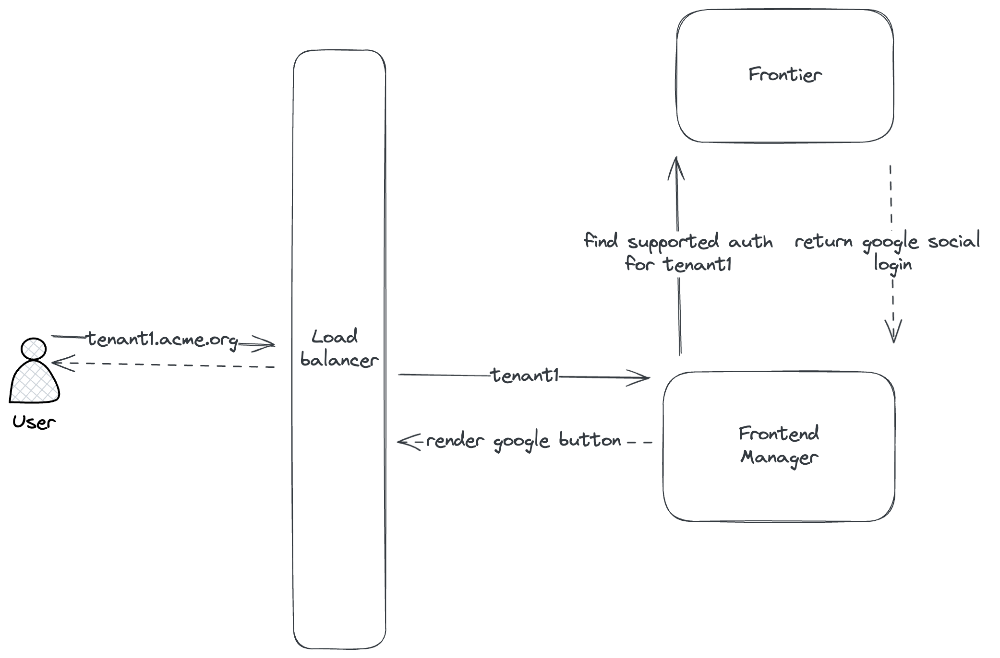
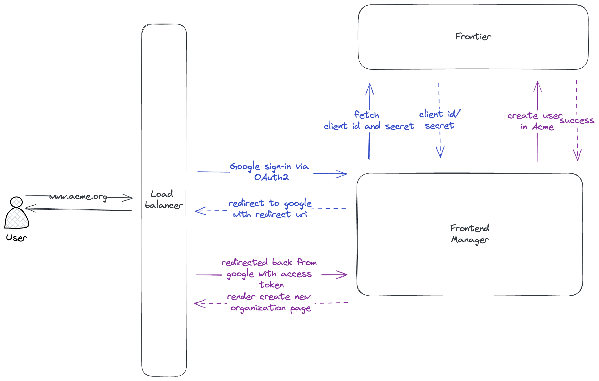
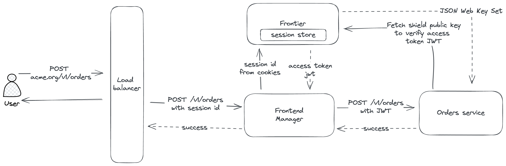
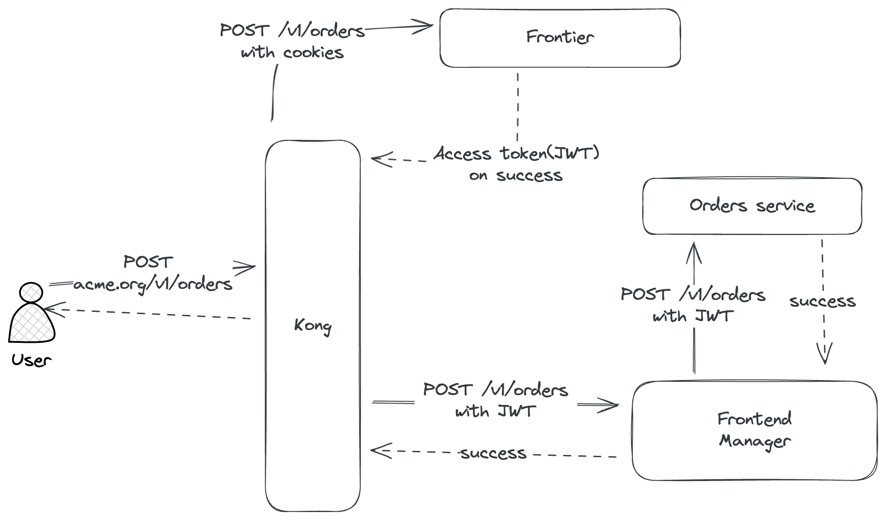

import Tabs from '@theme/Tabs';
import TabItem from '@theme/TabItem';
import CodeBlock from '@theme/CodeBlock';

# User Authentication

To integration User authentication with a frontend application, you need to configure either of the supported strategies
in Shield. Shield is a multi-tenant authentication server, so you can configure multiple strategies and use them in
different applications. Each tenant has its own organization and each organization can have its own set of allowed
authentication strategies. For now, if a strategy is enabled in Shield configuration, it is available to all the
organizations.



## Supported Strategies

1. **Social Login** - Google, Facebook, Github, etc.
2. **Email OTP** - Send a one time password to user's email address.

You can list all enabled strategies by running the following command

<Tabs groupId="api">
  <TabItem value="HTTP" label="HTTP" default>
        <CodeBlock className="language-bash">
    {`$ curl --location 'http://localhost:7400/v1beta1/auth'
--header 'Accept: application/json'`}
    </CodeBlock>
  </TabItem>
</Tabs>

### Social Login

Get the client id and client secret from the third party provider and configure it in the `oidc_config` section of the
`config.yaml` file.



To get OIDC configuration for Google, you can visit the following URL https://console.developers.google.com/ and 
create a new project. You’ll also need to create OAuth 2.0 credentials for the project since Google does not do that 
by default. From the sidebar, click the **Credentials** tab, then click **Create credentials** and choose 
**OAuth client ID** from the dropdown. 

Make sure you select the application type as **Web application**. Along with
basic information about the application it will also ask you for the **Authorized redirect URIs**. You need to specify
the external URL of your Shield server with the path `/v1beta1/auth/callback`. For example, if your Shield server is
running at `https://shield.example.com`, then the redirect URI will be `https://shield.example.com/v1beta1/auth/callback`.
Or if shield server is running behind a proxy server, you need to specify the external URL of the proxy server which will
then forward the request to Shield server at `/v1beta1/auth/callback`.

This callback url is used by the third party provider to redirect the user back to the Shield server after successful
authentication. Same config needs to be specified in the `oidc_callback_host` field of the `config.yaml` file. 
`oidc_callback_host` is required to generate the login URL for the third party provider that initiates the authentication
flow.

```yaml
app:
  port: 8000
  grpc: 
    port: 8001
  # cors_origin is origin value from where we want to allow cors
  cors_origin: http://localhost:3000
  # configuration to allow authentication in shield
  authentication:
    # to use shield as session store
    session:
      # both of them should be 32 chars long
      # hash helps identify if the value is tempered with
      hash_secret_key: "hash-secret-should-be-32-chars--"
      # block helps in encryption
      block_secret_key: "block-secret-should-be-32-chars-"
    # once authenticated, server responds with a jwt with user context
    # this jwt works as a bearer access token for all APIs
    token:
      # generate key file via "./shield server keygen"
      # if not specified, access tokens will be disabled
      # example: /opt/rsa
      rsa_path: ""
      # issuer claim to be added to the jwt
      iss: "http://localhost.shield"
      # validity of the token
      validity: "1h"
    # external host used for oidc redirect uri, e.g. http://localhost:8000/v1beta1/auth/callback
    oidc_callback_host: http://localhost:8000/v1beta1/auth/callback
    # oidc auth server configs
    oidc_config:
      google:
        client_id: "xxxxx.apps.googleusercontent.com"
        client_secret: "xxxxx"
        issuer_url: "https://accounts.google.com"
```

:::note
A sample demonstrating the flow can be found in `examples` directory.
:::
Sample flow for Google OIDC is as follows:

1. User goes to login page in the frontend application. Frontend application queries Shield server to fetch supported
authentication strategies and then renders the login page with the supported strategies.
2. User clicks on the Google button in the frontend application. Frontend application requests Shield server to generate
a login URL for Google.
<Tabs groupId="api">
   <TabItem value="HTTP" label="HTTP" default>
   <CodeBlock className="language-bash">
   {`$ curl --location 'http://localhost:7400/v1beta1/auth/register/google'
   --header 'Accept: application/json'`}
   </CodeBlock>
   </TabItem>
</Tabs>
3. Response from Shield contain the endpoint URL using which frontend application redirects the user to Google's 
login page.
4. Once user is logged in to google, Google redirects the user back to the frontend application 
with an authorization code.
5. Frontend application sends the authorization code to Shield server. Shield server verifies the code with Google and
register's a new user if this is the first time user is logging in. 
6. Shield server then creates a session and return the session details in cookies of the response headers.
7. Frontend application then redirects the user to the home page and browser saves the cookies.
8. Now all subsequent requests from the frontend application will have the cookies in the request headers.

### Email OTP

To use email OTP, you need to configure the SMTP server details in the `config.yaml` file.

```yaml
app:
  port: 8000
  grpc: 
    port: 8001
  # cors_origin is origin value from where we want to allow cors
  cors_origin: http://localhost:3000
  # configuration to allow authentication in shield
  authentication:
    # to use shield as session store
    session:
      # both of them should be 32 chars long
      # hash helps identify if the value is tempered with
      hash_secret_key: "hash-secret-should-be-32-chars--"
      # block helps in encryption
      block_secret_key: "block-secret-should-be-32-chars-"
    # once authenticated, server responds with a jwt with user context
    # this jwt works as a bearer access token for all APIs
    token:
      # generate key file via "./shield server keygen"
      # if not specified, access tokens will be disabled
      # example: /opt/rsa
      rsa_path: ""
      # issuer claim to be added to the jwt
      iss: "http://localhost.shield"
      # validity of the token
      validity: "1h"
    mail_otp:
      subject: "Shield - Login Link"
      # body is a go template with `Otp` as a variable
      body: "Please copy/paste the OneTimePassword in login form.<h2>{{.Otp}}</h2>This code will expire in 10 minutes."
      validity: "10m"
  # smtp configuration for sending emails
  mailer:
    smtp_host: smtp.example.com
    smtp_port: 587
    smtp_username: "username"
    smtp_password: "password"
    smtp_insecure: true
    headers:
      from: "username@acme.org"
```
:::note
A sample demonstrating the flow can be found in `examples` directory. 
:::
Sample flow for email OTP is as follows:

1. User goes to login page in the frontend application. Frontend application queries Shield server to fetch supported
authentication strategies and then renders the login page with the supported strategies.
2. User enters the email address and clicks on the Email OTP button in the frontend application. Frontend application
sends the email address to Shield server to start the login flow.
<Tabs groupId="api">
   <TabItem value="HTTP" label="HTTP" default>
   <CodeBlock className="language-bash">
   {`$ curl --location 'http://localhost:7400/v1beta1/auth/register/mailotp?email=example%40example.com'
   --header 'Accept: application/json'`}
   </CodeBlock>
   </TabItem>
</Tabs>
3. Shield server sends an email to the user with an OTP and returns a state in the response.
4. User enters the OTP in the frontend application and clicks on the Verify button. Frontend application sends the OTP
to Shield server to verify the OTP along with the state returned when the flow was created.
<Tabs groupId="api">
   <TabItem value="HTTP" label="HTTP" default>
   <CodeBlock className="language-bash">
   {`$ curl --location 'http://localhost:7400/v1beta1/auth/callback/?code=XXXXXX&state=XXXXXX'
   --header 'Accept: application/json'`}
   </CodeBlock>
   </TabItem>
</Tabs>
5. Shield server verifies the OTP and creates a new session.

## Request Verification

Once the user is verified and logged in, a session is created using cookies in user's browser. This is how the flow
looks like:



1. User logs in using the frontend application.
2. The frontend application sends a request to the Shield server with the cookies containing session details.
3. Shield server verifies the session and returns a JWT access token.
4. The frontend application forwards the request to backend microservices with access token.
5. The backend microservices verify the access token using Shield's public keys, if the token is valid, the request is
   processed.

:::note
Access token by default is returned as part of the response header **"x-user-token"** after successful login. This can be
requested again by sending a post request to the Shield server with the cookies containing session details on endpoint
`/v1beta1/auth/token`.
:::

Shield only generates the access token if the RSA keys are configured in the `config.yaml` file. If the RSA keys are not
configured, we can still use Shield as a session store and verify the session in the backend microservices. RSA keys are 
configured under `app.authentication.token` section in the `config.yaml` file.

:::note
To configure token `rsa_path` you can use shield cli and run `./shield server keygen` command which will generate
2 RSA keys.
:::

For simpler integrations, the frontend application can also choose to work as an identity aware proxy. In this case, the
frontend application will verify the session and forward the request to backend microservices where backend microservices
will assume all the request coming from the frontend application are authenticated.

Frontend Manager can also be replaced by a reverse proxy like **Kong**, which will do the same job as the frontend.



The JSON Web Key Set (JWKS) is a set of keys containing the Shield's public keys used to verify any JSON Web Token (JWT)
using the RS256 signing algorithm. Shield generated access token can be validated using the public key of the RSA key 
pair. The public key can be fetched from the Shield server from the endpoint `/.well-known/jwks.json`.

:::note
The key set can contain more than one key and is uniquely identified by the `kid` field. The JWT contains the `kid` field
in the header which is used to identify the key used to sign the JWT.
:::