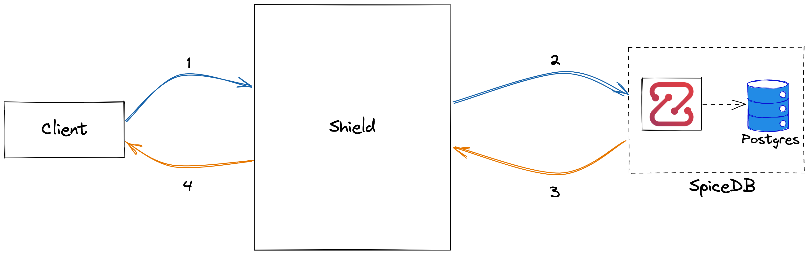

# Architecture

Frontier is a cloud-native role-based authorization-aware reverse-proxy service that helps you manage the authorization of given resources. In uses [SpiceDB](https://github.com/authzed/spicedb) authorization engine, which is an open source fine-grained permissions database inspired by [Google Zanzibar](https://authzed.com/blog/what-is-zanzibar/).

Frontier can be used as a reverse-proxy, intercepting the request between a client and the backend. It offers configurable authorization on each url path. This is handled by **authz middleware**. This is a non-mandatory step, and can be left unprotected as well.

A Resource Creation Hook comes handy when a resource needs to be created or updated in the backed. Frontier keeps a record or the resource within it's database in order to check authorization later. The resource creation/updation request goes to the backend and when a successful response is received, the hook creates an instance of it in the database.

We can also configure role assignments to certain user or group on this resource as well during the resource creation.

We will talk more with example about the rule configuration in detail, in the guides.
Frontier exposes both HTTP and gRPC APIs to manage data. It also proxy APIs to other services. Frontier talks to SpiceDB instance to check for authorization.

## Tools and Technologies

Frontier is developed with

- Golang - Programming language
- Docker - container engine to start postgres and cortex to aid development
- Postgres - a relational database
- SpiceDB - SpiceDB is an open source database system for managing security-critical application permissions.

## Components

### API Server

Frontier server exposes both HTTP and gRPC APIs (via GRPC gateway) to manage users, groups, policies, etc. It also runs a proxy server on different port.

### PostgresDB

There are 2 PostgresDB instances. One instance is required for Frontier to store all the business logic like user detail, team detail, User's role in the team, etc.

Another DB instance is for SpiceDB to store all the data needed for authorization.

### SpiceDB

Frontier push all the policies and relationships data to SpiceDB. All this data is needed to make the authorization decision. Frontier connects to SpiceDB instance via gRPC.

## Overall System Architecture - Frontier as an Authorization Service

Frontier when used as authentication service support variety of strategies. Once a user is authenticated, user identity
is stored in db. To manage browser session, it uses Cookies and for API calls, it uses JWT tokens. JWT tokens are created
and signed by Frontier using configured RSA keys and all backend services are expected to verify the token using public keys
when the token is received. Frontier exposes an API to get the public keys.

Frontier when used as an authorization service delegates all of its check to SpiceDB using the `check` API. 
A basic check is composed of 3 items, i.e. `can a USER do an ACTION on this RESOURCE`.

The API gives a boolean response. You can refer this [guide](../authz/permission.md#managing-permission) for usage information.

