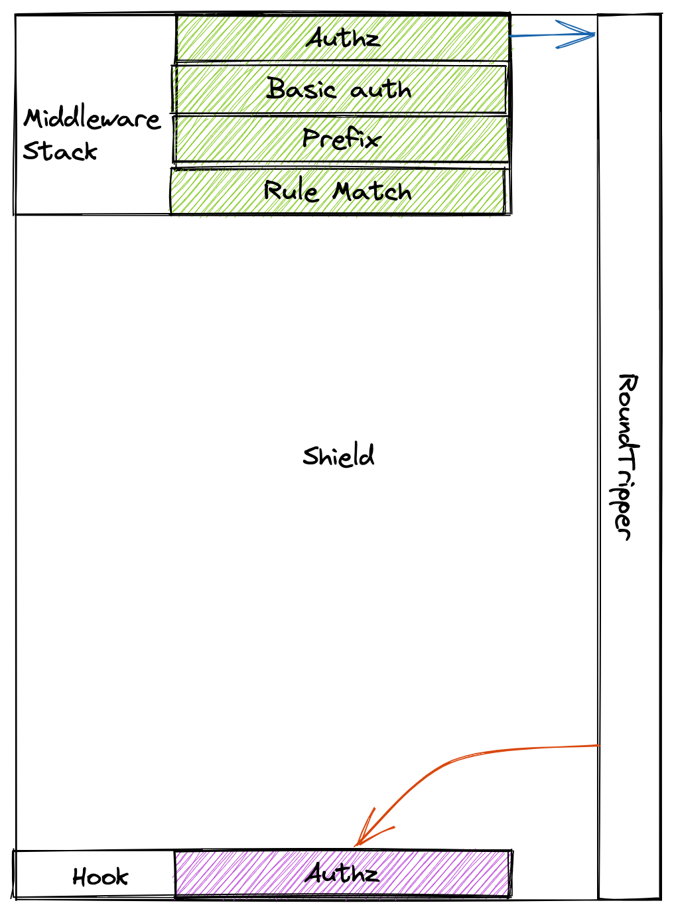

# Architecture
Shield exposes both HTTP and gRPC APIs to manage data. It also proxy APIs to other services. Shield talks to SpiceDB instance to check for authorization.

## Tools and Technologies

Shield is developed with

- Golang - Programming language
- Docker - container engine to start postgres and cortex to aid development
- Postgres - a relational database
- SpiceDB - SpiceDB is an open source database system for managing security-critical application permissions.

## Components

### API and Proxy Server

Shield server exposes both HTTP and gRPC APIs (via GRPC gateway) to manage users, groups, policies, etc. It also runs a proxy server on different port.

### PostgresDB

There are 2 PostgresDB instances. One instance is required for Shield to store all the business logic like user detail, team detail, User's role in the team, etc.

Another DB instance is for SpiceDB to store all the data needed for authorization.

### SpiceDB

Shield push all the policies and relationships data to SpiceDB. All this data is needed to make the authorization decision. Shield connects to SpiceDB instance via gRPC.

## Overall System Architecture - Shield as an Authorization Service

Shield can be used as an authorization service using the `check` API. Currently, we just have permission to check over an individual resource, i.e. 
`can a USER do an ACTION on this RESOURCE`.


The API gives a boolean response. You can refer this [guide](docs/guides/check-permission.md) for usage information.

## Overall System Architecture - Shield as a Proxy


The above diagram shows the system architecture which uses shield as a proxy. 

Let's have a look at the major events:

- Middleware: Middlewares as their names suggest are engaged befor the request is proxied.
There are a few different middlewares which are `rule-matching`, `prefix`, `basic_auth`, `attribute` and `authz`.
We'll discuss each one in details in the upcoming sections.

- Hook: Hooks are engaged after a response is received form the backend service. Currently we just have a single resource creation hook named `authz`. 

Let's have a look at the Shield's Architecture where we will also be discussing about the different middlewares and hoooks.

## Shield Proxy Architecture



Sheild's proxy is build from two major components which are middlewares and hooks. Let's dive deeper into each of these components.

### Middleware

Middlewares in shield have the following interface. 

```go
type Middleware interface {
	Info() *MiddlewareInfo
	ServeHTTP(rw http.ResponseWriter, req *http.Request)
}

type MiddlewareInfo struct {
	Name        string
	Description string
}
```

Shield is designed to execute the middlewares in a fixed order maintained by a stack.
The order followed is
- Rule match
- Attributes
- Basic auth
- Authz
- Prefix

#### Rule match
The rule match middleware finds the rule configured for a path and enriches the `ctx` with it. It also enriched the `ctx` with the request body.

#### Attributes
The attributes middleware builds a map of the attributes passed and enriches the `ctx` with it.

#### Basic auth
This middleware can be configured to support basic authentication with shield.

#### Authz
This middleware checks in the SpiceDB if the user is authorized with atleast one (OR operation) the permissions.

#### Prefix
This middleware strips a configured prefix from the request's URL path.

## Hook
Hooks in shield have the following interface.

```go
type Service interface {
	Info() Info
	ServeHook(res *http.Response, err error) (*http.Response, error)
}
```

Shield only have a single hook

- Authz

#### Authz
Authz hook persists the resource been created in the configfured backencd in Shield's DB. It does not create any relation by default but relations can be configured too. The relashions are created and stored both in Shield's DB and SpiceDB.

