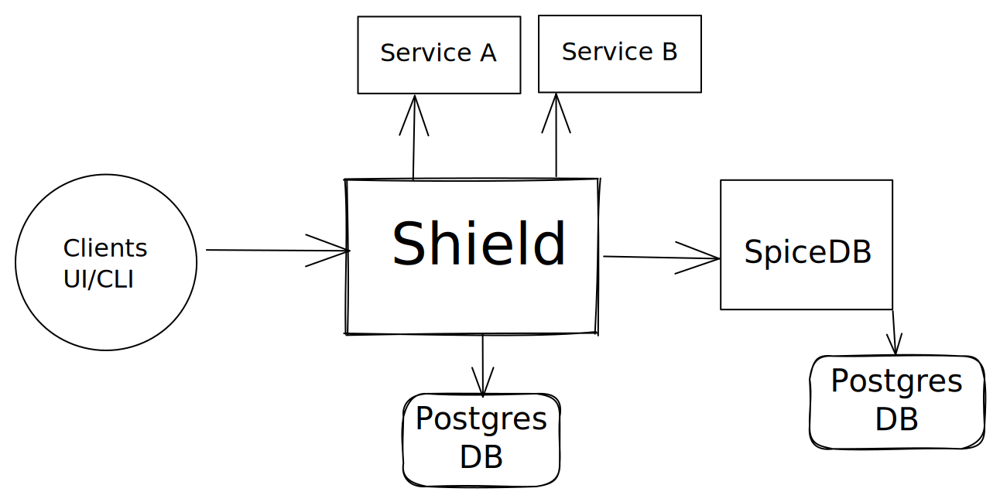

# Architecture

Shield exposes both HTTP and gRPC APIs to manage data. It also proxy APIs to other services. Shield talks to SpiceDB instance to check for authorization.

## Technologies

Shield is developed with

- Golang - Programming language
- Docker - container engine to start postgres and cortex to aid development
- Postgres - a relational database
- SpiceDB - SpiceDB is an open source database system for managing security-critical application permissions.

## Components

### API and Proxy Server

Shield server exposes both HTTP and gRPC APIs (via GRPC gateway) to manage users, groups, policies, etc. It also runs a proxy server on different port.

### PostgresDB

There are 2 PostgresDB instances. One instance is required for Shield to store all the business logic like user detail, team detail, User's role in the team, etc.

Another DB instance is for SpiceDB to store all the data needed for authorization.

### SpiceDB

Shield push all the policies and relationships data to SpiceDB. All this data is needed to make the authorization decision. Shield connects to SpiceDB instance via gRPC
