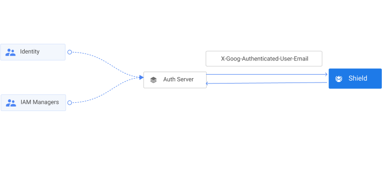

# Authentication

Authentication and authorization might sound similar, but they are distinct security processes in the world of identity and access management (IAM).
Authentication confirms that users are who they say they are. Authorization gives those users permission to access a resource.
This section describes how Shield authenticates a user.

## Google IAP

Shield currently relies on [Google IAP](https://cloud.google.com/iap) for authenticating users. Google IAP servers route all requests with a `X-Goog-Authenticated-User-Email` header, which contains the user's email.

If you don't want to use Google IAP for authenticating your users then you can use your own server to authenticate your users and then forward the request to Shield. You just have to send the user's email in the `X-Goog-Authenticated-User-Email` header. The assumption here is that your service also relies on email for identifying a user.

The deployment will look as below:

PS: We do plan to introduce multiple authenctication mechanisms such as login with Google, Facebook, etc. in Shield natively rather than rely on an external authentication server. If you would like to extend Shield to enable other authentication mechanism then checkout the `iap plugin` in the codebase.
