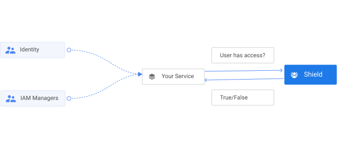

# Using as an external Authorization service



One way to use Shield is to use it as an external authorization service, which authorizes calls made from your service.

Say you want to protect the `PUT /api/books/relativity-the-special-general-theory` endpoint given in the [example](managing_policies.md).
Then within your service, you can call the `/api/check-access` endpoint of Shield to check whether Einstein has access.

```text
POST /api/check-access


Request Body:

[
    {
        "suject": {
            "user": "10253480-2ac8-4073-9084-5f059dbf6fae"
        },
        "resource": {
            "urn": "relativity-the-special-general-theory"
        },
        "action": {
            "action: "book.update"
        }
    }
]

Response:

[
    {
        "suject": {
            "user": "10253480-2ac8-4073-9084-5f059dbf6fae"
        },
        "resource": {
            "urn": "relativity-the-special-general-theory"
        },
        "action": {
            "action: "book.update"
        },
        "hasAccess": true
    }
]
```

The above response will return `{"hasAccess": true}` since `Einstein` is permitted to `book.update` for the Book `relativity-the-special-general-theory` as he was assigned `Book Manager` role for `{"group": "80553880-23c8-4073-9094-7f059avf6ftp", "category": "physics"}`

Based on this API's response, you can decide within your application to either forbid or allow the user.
