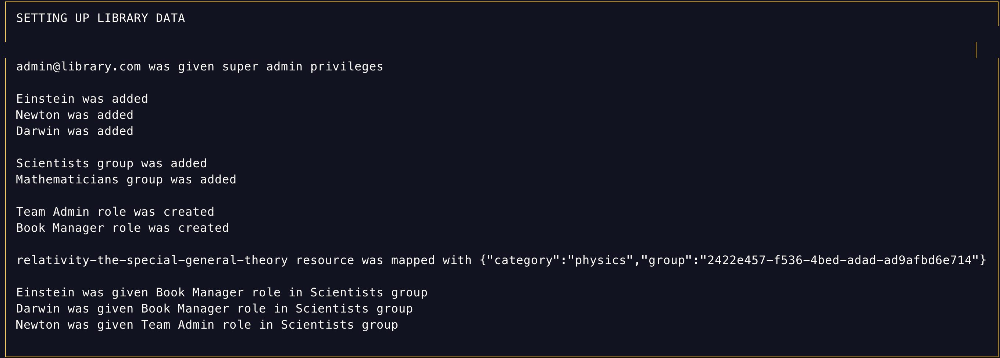

# Quickstart

We have created an example to help you get started with Shield. The library application mentioned [here](guides/managing_policies.md) has been implemented in the `example` directory.

### Get started in a few simple steps

```text
# clone the repository if you don't have it yet
git clone https://github.com/odpf/shield.git && cd shield

docker-compose -f example/docker-compose.yml up

```

### Output

Wait for some time until you see this output in the terminal.




You can check `http://localhost:5000/documentation` to view all the APIs of the Shield.
