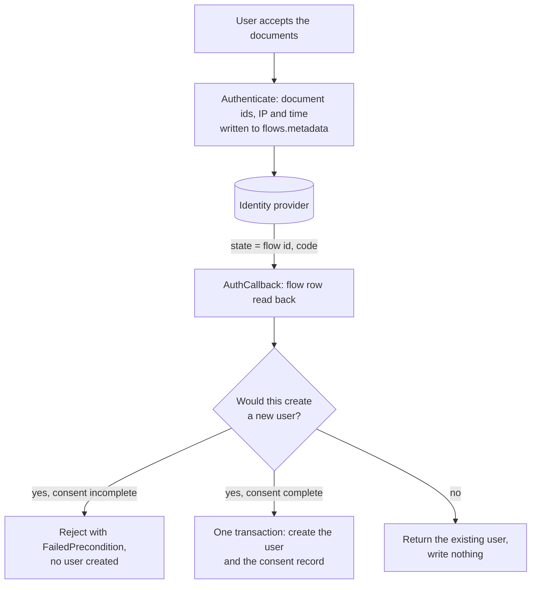

# RFC 0002: Explicit consent at signup

| | |
|---|---|
| **Status** | Draft. Not implemented. |
| **Author** | Rohan Chakraborty |
| **Created** | 2026-08-26 |
| **Updated** | 2026-08-27 |

## Summary

Frontier can make a user accept a set of documents before their account is created, and store one
consent record for it.

A deployment lists its documents in server config with an id, title, version and URL. The client
sends the document ids the user accepted. Frontier checks the ids cover every document in config,
then creates the user and the consent record together. The record lists each accepted document
with the version and URL from config.

If `app.consent` is not enabled, nothing changes. Frontier never parses document contents or
version strings.

## Problem

Frontier creates a user at the end of a registration flow and stores nothing about what the user
agreed to. Three gaps.

Finishing signup is the only evidence of agreement. A record built from that only says the user
signed up, which we already know. It cannot tell apart a user who read the documents from one who
never saw them.

There is nothing to show when someone asks which documents a user accepted, and when.
`users.metadata` does not work for this: `UpdateUser` and `UpdateCurrentUser` both replace the
whole map, so a user can delete their own consent by editing their profile, and the metadata goes
away with the user row.

Documents have versions, but nothing records which version a user accepted, so you cannot tell
which one applies to them.

## Goals

- The client sends consent explicitly. The server rejects signup when it is missing.
- No API can update or delete a consent record. Deleting the user does not delete it either.
- A consent record stores the version and URL of every document it covers.
- Document ids, titles, versions and URLs come from config. Frontier does not read them.
- Deployments that do not set or enable `app.consent` behave exactly as before.

## Non-goals

Re-consent, withdrawal, and users who already exist. When a document version changes, old consent
records keep pointing at the old version and nobody is asked again.

Repairing a missing consent record. A record is written when a user is created and at no other
time. There is no path that adds one to an account that already exists.

Frontier does not host the document text and does not serve the document list. Clients keep their
own copy of the list. The SDK sign-up view gets a checkbox so it still works when consent is
enabled, but the copy, the links and any second checkbox are the consumer's.

## Document config

A map under `app.consent`, keyed by document id:

```yaml
app:
  consent:
    enabled: true
    documents:
      terms_of_service:
        title: Terms & Conditions
        version: "2026-04-01"
        url: https://example.org/legal/terms/2026-04-01
      privacy_policy:
        title: Privacy Policy
        version: "2026-04-01"
        url: https://example.org/legal/privacy/2026-04-01
```

`app.consent` sits next to `app.authentication` and `app.pat` on `server.Config`. A document has an
id, a title, a version and a URL, and nothing else. The example lists two; a deployment lists all of
its documents, and they have to be in config from the first release, for the reason below.

A map, not a list, for three reasons. It matches `authenticate.Config`, which already keys
`oidc_config` by strategy name. The map key is the document id, so two documents cannot use the
same one. And you can override a single field with an env var, which you cannot do for one item in
a list of objects.

There is no per-document `required` flag. Every document in the map is required at signup. A flag
would put two lists in config, all documents and the required subset, where one does the job, and
an optional document is a different feature: it needs withdrawal, which is out of scope. The cost
is that adding a new document id breaks signup for clients still sending the old list, so a new
document and the client release that sends it have to ship together. Version bumps are unaffected,
since the client only sends ids.

`version` is an opaque string that frontier only compares for equality, so a deployment can use
dates, semver or commit SHAs.

`enabled` is one switch for the whole feature. With `app.consent` absent or `enabled` false,
frontier behaves exactly as it does today: no check runs, no record is written, and
`accepted_document_ids` is ignored rather than rejected, so one client build works against both
kinds of deployment. With `enabled` true, every document in the map is required. `enabled` true
with no documents fails at boot instead of quietly turning the feature off.

Config is read once at boot, so changing a document version needs a restart. Keys are
env-overridable like the rest of frontier's config. An override cannot change an existing consent
record, because records are immutable and each holds its own copy of the version, but it can
produce wrong new ones. So the resolved document set is logged at boot. That log, not the config
repo, tells you what a deployment was actually serving.

Bad config fails at boot instead of at the first signup: document ids, versions and URLs must be
non-empty, URLs must parse, and an enabled block needs at least one document.

## The request field

One repeated field on the existing `AuthenticateRequest`:

```proto
repeated string accepted_document_ids = 6;
```

Field 6 is free: `AuthenticateRequest` ends at `callback_url = 5` today.

Document ids, not a single boolean, because the client has its own copy of the document list and
the two can go out of sync. With ids, frontier sees the mismatch and rejects the signup. With a
boolean it would stamp whatever config holds and write a consent record saying the user accepted
a document they were never shown, and nothing would catch it. Ids also leave room for consenting
to a subset later without changing the field.

Ids and nothing else. The client never sends versions, titles or URLs, and frontier would not use
them if it did, since everything on a consent record is stamped from config. Duplicate ids are
de-duplicated before the check.

## Carrying consent across the redirect

In an OIDC flow the user accepts the documents before the browser leaves for the identity
provider, and the account is created after it comes back:



The only thing that survives the redirect is `state`, which already holds the flow id and is
visible to the browser and the provider. So the consent goes where the flow id points.
`Flow.Metadata` is a JSONB column that already carries `callback_url`, and `StartFlow` writes one
more key:

```go
flow.Metadata["consent"] = map[string]any{
    "accepted_document_ids": ids,
    "ip_address":            ip,
    "at":                    s.Now(),
}
```

The flow row is written before the redirect and read after it comes back, so the consent never
goes through the browser and cannot be changed on the way. The IP and time stored are from when
the user accepted, not from the callback. Mail OTP and passkey use the same path, so there is one
code path for every strategy.

`Authenticate` and `AuthCallback` are both in `authenticationSkipList`, so the authentication
interceptor does not run and nothing puts session metadata in the context. The `Authenticate`
handler has to call `sessionutils.ExtractSessionMetadata` itself and pass the IP into `StartFlow`.
That helper returns `session.SessionMetadata`, whose `IpAddress` is the leftmost value of the
configured client IP header. It parses the user agent into an OS and a browser family and drops the
raw string, which is why the record keeps only the IP.

`Flow.Metadata` is `map[string]any` stored as JSONB, so it does not return the types it was given:
the ids come back as `[]any` and `at` as an RFC 3339 string. One typed parser handles the read, the
way `otpAttempts` already does for the attempt counter, rather than an unchecked assertion like
`flow.Metadata["callback_url"].(string)`. A missing or unparseable consent key counts as no consent.

This also fixes something unrelated. `applyOIDC` never calls `consumeFlow`, so OIDC flow rows sit
around until the expiry cron while mail OTP rows are deleted on use. That is hard to justify once
those rows hold consent.

## Enforcement

The consent service owns the config, so it owns both checks. They are separate functions because
signup and any later use want different rules:

```go
// Resolve maps ids to their config snapshots. Rejects unknown ids.
// Says nothing about whether the set is complete.
func (s Service) Resolve(ids []string) ([]Document, error)

// ResolveAll is Resolve plus the completeness rule: the ids must cover
// every document in config, no more and no less.
func (s Service) ResolveAll(ids []string) ([]Document, error)

// Grant writes one consent record for the documents given.
// No completeness rule here at all.
func (s Service) Grant(ctx context.Context, tx *sqlx.Tx, req GrantRequest) error
```

`ResolveAll` compares the two sets in both directions, so the error names what is wrong: which
required ids are missing, or which sent ids config does not know. `Grant` takes whatever it is
given, which is what leaves room for a later re-consent covering one document without a second
write path.

Consent is stored at the start of the flow and required at user creation. It cannot be required at
the start: in an OIDC flow the email is not known yet, so a signup and a login look like the same
request. What the `Authenticate` handler can do is call `Resolve` on any ids it was sent, so an
unknown id fails before the browser leaves for the provider. `ResolveAll` runs at user creation,
which is the first point where frontier knows who the user is and that they are new.

So `getOrCreateUser` takes the flow, which is nil for the one caller that has none, and:

- New user, `ResolveAll` passes: one transaction creates the user row and the consent record.
- New user, `ResolveAll` fails: return `ErrConsentRequired` and create nothing. `AuthCallback` maps
  it to `FailedPrecondition` so the client can tell it apart from a bad code or an expired flow and
  ask again.
- Existing user: log them in and write nothing, whatever the flow holds.

A rejection ends the flow. The user starts a new one with a complete set, and for mail OTP that
means a fresh code, since `applyMailOTP` calls `consumeFlow` before it creates the user. Reusing
the flow would only let the same client assert the same wrong set again.

The third case is absolute. There is no branch that notices a missing consent record and fills it
in. A record written outside a user creation would carry that moment's timestamp and IP for an
agreement that happened somewhere else, which is worse than having no record: it reads like real
evidence.

That is why the transaction matters. `ResolveAll` runs before the transaction opens, so an
incomplete payload never starts one. Inside it, the user insert and the consent insert either both
land or neither does. Without the transaction a failed consent insert would leave an account with
no consent record and nothing able to repair it, which is the gap this feature exists to close.
`pkg/db` has `WithTxn`, but no context-carried transaction, so both repositories need a `Create`
that accepts the `*sqlx.Tx`. That is additive and breaks no existing caller. If threading the
transaction through the user repository is rejected, the fallback is to delete the user row when
the consent insert fails and log loudly if that delete also fails.

### The other paths that create users

`getOrCreateUser` has five callers, and two paths create a user row without going through it at all:

| Path | With consent enabled |
|---|---|
| `applyOIDC` | gated: the flow carries the consent |
| `applyMailOTP` | gated: the flow carries the consent |
| `finishPassKeyRegisterMethod` | gated: the flow carries the consent |
| `finishPassKeyLoginMethod` | gated: a first-time passkey login is a signup |
| `authenticateWithPassthroughHeader` | not gated: no flow exists |
| `organization.Service.AdminCreate` | not gated: operator action, no flow |
| `CreateUser` RPC | not gated: operator action, no flow |

The four flow-based paths are the ones a person signs up through, and they are the ones this RFC
closes. The other three are exempt because no account holder is present to consent:
`authenticateWithPassthroughHeader` provisions from `app.identity_proxy_header`, which already
warns that it bypasses authorization, and `AdminCreate` and `CreateUser` are operator actions.

Exempt means those accounts get no consent record, the same as users who already exist. A
deployment that wants full coverage keeps all three out of its signup path: `identity_proxy_header`
unset outside development, and the two operator RPCs used only for accounts nobody signs up for.
Limitations records the residual gap.

## Storage

One consent record per consent, listing the documents it covers.

```sql
CREATE TABLE user_consents (
    id           UUID PRIMARY KEY DEFAULT uuid_generate_v7(),
    user_id      UUID        NOT NULL,
    user_email   TEXT        NOT NULL,
    documents    JSONB       NOT NULL,
    source       TEXT        NOT NULL DEFAULT 'signup',
    auth_method  TEXT,
    ip_address   TEXT,
    consented_at TIMESTAMPTZ NOT NULL,
    created_at   TIMESTAMPTZ NOT NULL DEFAULT NOW(),
    metadata     JSONB       NOT NULL DEFAULT '{}',

    CONSTRAINT documents_not_empty CHECK (
        jsonb_typeof(documents) = 'array' AND jsonb_array_length(documents) > 0
    )
);

CREATE UNIQUE INDEX uq_user_consents_signup
    ON user_consents(user_id) WHERE source = 'signup';

CREATE INDEX idx_user_consents_documents
    ON user_consents USING GIN (documents jsonb_path_ops);
```

`documents` holds one object per accepted document, copied from config at write time:

```json
[
  {
    "id": "terms_of_service",
    "title": "Terms & Conditions",
    "version": "2026-04-01",
    "url": "https://example.org/legal/terms/2026-04-01"
  },
  {
    "id": "privacy_policy",
    "title": "Privacy Policy",
    "version": "2026-04-01",
    "url": "https://example.org/legal/privacy/2026-04-01"
  }
]
```

Four fields per document, the same four config holds. A field added later appears on new records
only, since old ones keep the shape they were written with.

`metadata` is written once at insert like every other column and is empty today. It gives a later
re-consent somewhere to record its own context without a migration. Nothing reads it.

The grain is the consent, not the document. A user accepts a set of documents in one act, at one
time, from one IP, so `user_email`, `ip_address` and `consented_at` describe the act and are stored
once. It also means the same write path covers a later re-consent for any subset, because the
document list is an argument rather than something the schema fixes. The cost is that the
per-document fields sit inside JSON, which the queries below cover.

Four things in there are deliberate and look like mistakes otherwise.

There is no foreign key to `users`. `UserRepository.Delete` does a hard `DELETE`, so
`ON DELETE CASCADE` would drop the consent records and `ON DELETE RESTRICT` would block account
deletion. Consent records have to survive the user being deleted, which is also why `user_email`
is denormalized: once the user row is gone there is nothing left to join to. `ip_address` is
`TEXT` and not `INET` because the value comes from a request header, and a bad one must not fail a
signup. For the same reason it is nullable: a deployment that does not set the header gets a record
with no IP rather than a failed signup.

The document versions and URLs are copies, not references. A consent record has to stay readable
years later and stay correct after the document is dropped from config. It is also why a document
table can be added later with no backfill: no consent record points at one.

The unique index means a user gets at most one signup consent. Since nothing repairs a record, a
second signup write for the same user is a bug, and this makes it fail instead of leaving two rows
disagreeing about what happened.

Consent records cannot be changed. A `BEFORE UPDATE` and a `BEFORE DELETE` trigger both raise
`45000`, following `20250904105226_add_audit_records_immutability.up.sql`, which does the same for
`audit_records`. That migration guards only `UPDATE`; `DELETE` is guarded here too, because a
deleted consent record leaves a user who looks like they never consented. The repository has
`Create` and nothing else, so no admin API path reaches a record even if a trigger gets dropped.
`DROP TABLE` still works, so `migrate down` is fine.

A signup also writes one `user.consent_granted` audit record so the audit trail shows it happened.
The consent record is the source of truth; if the audit write fails, log it and carry on.

## Reading it back

There is no read API and no view. A reporting tool points at `user_consents` and reads the rows as
they are, one per consent, with the accepted documents in `documents`.

A record is self-contained, so "what did this user accept, and when" is one row. The reverse, "who
accepted privacy policy 2026-04-01", is a containment filter:

```sql
SELECT user_email, consented_at, ip_address
FROM user_consents
WHERE documents @> '[{"id": "privacy_policy", "version": "2026-04-01"}]';
```

`@>` is what the GIN `jsonb_path_ops` index on `documents` serves, so that filter uses the index. A
view would be one more object to keep in step with the table it summarizes.

## Client

Frontier ships its own sign-up view in `web/sdk/client/views/auth/sign-up`. It calls `authenticate`
for the OIDC buttons and hands mail OTP to `MagicLinkView`, which calls `authenticate` itself.
Neither sends ids, so with consent enabled the shipped view cannot complete a signup. It gets an
Apsara `Checkbox`:

```tsx
export type SignUpViewProps = /* ... */ & {
  consent?: {
    documentIds: string[];
    label?: ReactNode;
  };
};
```

The prop is optional and the checkbox renders only when it is passed, so a deployment with consent
disabled sees the view it sees today. When it is passed the checkbox starts unchecked, every
sign-up control stays disabled until it is checked, and `documentIds` goes out as
`accepted_document_ids`. `MagicLinkView` takes the ids as a prop, so both strategies go through one
control.

`label` takes a `ReactNode` so the consumer supplies the copy and the links. The default is plain
text without links, since the SDK does not know the documents or their URLs. A second checkbox or a
per-document link is a consumer rendering its own view and calling `authenticate` directly, which
already works today.

`documentIds` comes from the consumer because frontier does not serve the document list. It is the
duplication Limitations describes, now visible in a prop.

## Alternatives considered

1. Consent in `users.metadata`. Both update paths replace the whole map, so a user can delete
   their own consent record, and it goes away with the user row.

2. Consent in `audit_records`. `CreateAuditRecord` takes any event string with a client-supplied
   `occurred_at`, gated on platform `check`, which both the admin and member relations grant. Any
   platform member could insert a backdated consent record. A table with no write RPC can only be
   written by the signup path.

3. One row per accepted document instead of one per consent. It puts every field in a column, but
   it repeats the email, IP and timestamp on every row, and it needs a synthetic event id to answer
   "what did this user accept in one sitting" once there is more than one occasion. The act is what
   is being recorded, so the act is the row.

4. A `consent_documents` table instead of config. Each consent record already copies its document
   versions, so the records are the version history and the table answers no query they cannot.
   Config sits in git, which is a better change log than rows an admin can edit, and a table would
   need a write API, which is one more way to change what the server stamps.

5. A `ConsentDocument` reconcile kind. The reconciler drives the admin API over RPC, so a kind
   needs list and write RPCs plus a table, and it would make the document list editable by any
   superuser. A restart is the narrower path.

6. An RPC for the document list. Clients keeping their own copy costs one proto field for the
   whole feature instead of a new endpoint. Deployments that want one source of truth can generate
   both the config block and the client's copy from a single file.

7. Taking consent in `AuthCallback`. The client would have to stash it locally and resend it after
   the redirect, so the consent record would attest to a client re-assertion made after the fact,
   the IP would be the post-redirect one, and it would break when the provider comes back into a
   different tab.

8. Requiring the full document set at flow start. In an OIDC flow that looks the same as a login,
   so it would block returning users. Only the unknown-id check can run there.

9. A login or signup intent on `AuthenticateRequest`, which would make a signup identifiable at
   flow start and let the full check run before the redirect. It also turns an unknown email on
   login into an account enumeration oracle on an unauthenticated endpoint, which frontier does
   not have today because it auto-provisions. Not worth it for an earlier error.

10. Repairing a missing consent record on a later login. See Enforcement.

## Limitations

Changing a document version needs a redeploy, since config is read at boot.

The client's document list and the server's are declared separately and can go out of sync. Ids
catch a set mismatch. A version mismatch is undetectable, since the client sends no versions: a
client showing version A against a config holding version B produces a record that says B. Only
frontier serving the list would close that.

A record ties to a version string, not to the document text. Editing the file at a URL without
bumping the version leaves every record for that version describing something the user did not see.
A per-document hash would close it and can be added later, since a document object is just JSON.

The IP is only as good as the header it comes from. A proxy that appends to `X-Forwarded-For`
instead of overwriting it leaves the value under the caller's control, and a deployment that does
not set the header at all gets records with no IP.

Users who already exist get no consent record, and nothing will ever give them one, so you never
get to full coverage. Neither do users created through the three exempt paths under Enforcement.
"No account without consent" holds for the signup flow, not for every row in `users`, and a
deployment has to accept that distinction before it relies on the records.

Sharing a transaction with the user insert means the user repository gains a create that takes a
transaction. It is additive, but it is the one place this feature reaches outside its own domain.

## Future work

Re-consent when a document version changes. The write path already handles it: `Grant` takes the
document list as an argument and `source` separates one occasion from another. What is missing is
enforcement, which has to move from user creation to a gate on authenticated requests, roughly
what Keycloak's terms and conditions required action does. That is its own feature.

A document list endpoint, if clients keeping their own copy turns out to be too fragile.
`ListAuthStrategies` is unauthenticated and already fetched by the sign-in page, so the resolved
document set could ride along on it instead of needing a new RPC, and the SDK sign-up view could
render the documents rather than be handed their ids.

A per-document hash in config, copied into the record, to tie a consent to the document text and
not to a version string someone typed into config.

A `ConsentDocument` reconcile kind, if restarts become a problem. It needs list and write RPCs and
a `consent_documents` table keyed by `(document_id, version)`. The config map maps onto that
directly and nothing needs backfilling, since no consent record points at it.

Withdrawal, which needs a decision on what happens to the account.

A reserved-event guard on `CreateAuditRecord`, so events frontier writes itself cannot be injected
through the public RPC. Not part of this feature, but the same gap lets any platform member forge
a backdated `pat.revoked`.

## References

- [RFC 0001: Declarative management of platform resources](0001-declarative-reconcile.md), for the
  reconcile flow mentioned above.
- ISO/IEC 29184:2020, *Online privacy notices and consent*, and the Kantara Consent Receipt
  specification, which the field list follows.
- RFC 9126, *OAuth 2.0 Pushed Authorization Requests*, for keeping request data server-side behind
  a handle.
- Digital Personal Data Protection Act, 2023, section 6(1), for the "clear affirmative action"
  standard.
