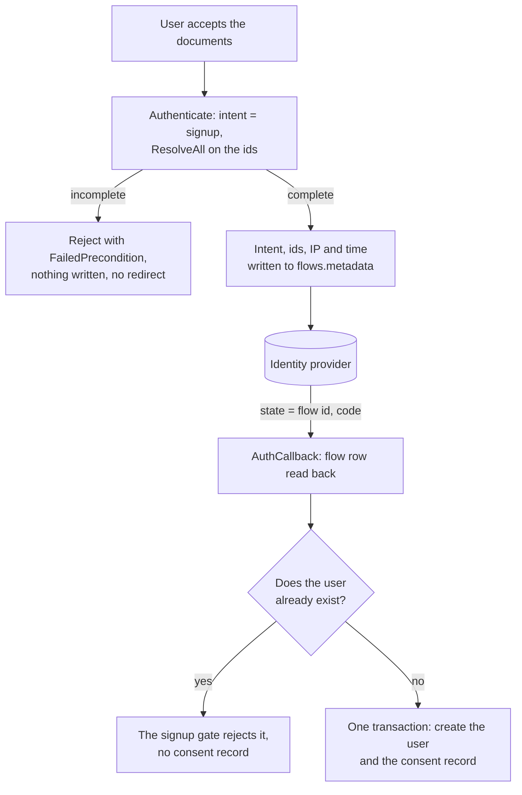

# RFC 0002: Explicit consent at signup

| | |
|---|---|
| **Status** | Draft. Not implemented. |
| **Author** | Rohan Chakraborty |
| **Created** | 2026-08-26 |
| **Updated** | 2026-08-27 |

## Summary

Frontier can require a user to accept a set of documents before their account is created, and store
one consent record for it.

A deployment lists its documents in server config with an id, title, version and URL. A public
endpoint serves that list, and the client sends back the ids the user accepted. Frontier checks that
the ids cover every document in config, then creates the user and the consent record in one
transaction. The record copies each document's version and URL from config.

Consent applies to signups only, and frontier cannot tell a signup from a login today. So this RFC
also adds a flow intent, which is what lets the consent check run before the browser leaves for the
identity provider.

With `app.consent` disabled, nothing changes. Frontier never reads document contents and never
parses version strings.

## Problem

Frontier creates a user at the end of a registration flow and stores nothing about what the user
agreed to. Four gaps.

Finishing signup is the only evidence of agreement, and it proves nothing. It cannot separate a user
who read the documents from one who never saw them.

Nothing answers "which documents did this user accept, and when". `users.metadata` cannot hold it,
because `UpdateUser` and `UpdateCurrentUser` replace the whole map, so a user could delete their own
consent by editing their profile.

Documents are versioned, but nothing records which version a user accepted.

Frontier does not know which requests are signups. `SignInView` and `SignUpView` are the same view
with different strings, `AuthenticateRequest` and `Flow` carry no intent, and every strategy ends at
`getOrCreateUser` (`core/authenticate/service.go:784`), which returns the existing user or creates
one. So a login with an unknown address creates the account, through a view that never showed the
documents.

## Goals

- The client sends consent explicitly. Signup fails without it.
- No API can update or delete a consent record. Deleting the user does not delete it.
- A record stores the version and URL of every document it covers.
- Document ids, titles, versions and URLs come from config, and the client reads them from frontier.
- A login never creates an account. A signup never logs an existing user in.
- The auth flow stays one RPC and one callback, plus one read-only endpoint for the list.
- Deployments without `app.consent`, and clients without an intent, behave as before.

## Non-goals

Re-consent and withdrawal. When a version changes, old records keep the old version and nobody is
asked again.

Consent for users who already exist, or for the three paths that create a user without a flow. A
record is written at user creation and nowhere else.

Making the login gate a security boundary, or hiding whether an address has an account. Limitations
says what both cost.

Serving the document text. The list endpoint returns URLs, and frontier never reads what is behind
them.

## Document config

A map under `app.consent`, keyed by document id:

```yaml
app:
  consent:
    enabled: true
    documents:
      terms_of_service:
        title: Terms & Conditions
        version: "2026-04-01"
        url: https://example.org/legal/terms/2026-04-01
      privacy_policy:
        title: Privacy Policy
        version: "2026-04-01"
        url: https://example.org/legal/privacy/2026-04-01
```

`app.consent` sits next to `app.authentication` and `app.pat` on `server.Config`. The example lists
two documents; a deployment lists all of its own.

A map, not a list: it matches `authenticate.Config` keying `oidc_config` by strategy name, the key
enforces unique ids, and a single field stays env-overridable.

Every document in the map is required at signup, so there is no per-document `required` flag. An
optional document would need withdrawal, which is out of scope. Adding a document id breaks signup
for a client sending a hardcoded list, which is why the list is served over an endpoint. Version
bumps are safe either way, since the client sends only ids.

`version` is opaque. Frontier compares it for equality, so dates, semver or commit SHAs all work.

`enabled` switches the whole feature. Absent or false, frontier behaves as it does today, and
`accepted_document_ids` is ignored rather than rejected, so one client build works against both
kinds of deployment. True with no documents fails at boot rather than silently disabling itself.

Config is read at boot, so a version change needs a restart. An env override cannot alter an
existing record, but it can produce wrong new ones, so the resolved set is logged at boot. That log,
not the config repo, says what a deployment was serving.

Bad config fails at boot: ids, titles, versions and URLs must be non-empty, URLs must parse, and
an enabled block needs at least one document.

## The document list endpoint

`ListConsentDocuments`, unauthenticated, so a sign-up view can render the documents it is asking the
user to accept:

```proto
message ConsentDocument {
  string id      = 1;
  string title   = 2;
  string version = 3;
  string url     = 4;
}

message ListConsentDocumentsRequest {}

message ListConsentDocumentsResponse {
  repeated ConsentDocument documents = 1;
}
```

It returns the resolved config set, all four fields per document, ordered by id so the response is
stable.

With `app.consent` disabled it returns an empty list rather than an error, so one client build works
against both kinds of deployment: no documents means no checkbox.

The handler mirrors `ListAuthStrategies` (`internal/api/v1beta1connect/authenticate.go:302`). It
reads the consent service, touches no database, and joins `authenticationSkipList` beside
`ListAuthStrategies` and `Authenticate`.

Public, because the documents are already public: the URLs are meant to be read by anyone
considering an account, and the ids are an input to an unauthenticated `Authenticate`. Requiring a
session to learn what to accept before the account exists is a cycle.

Not folded into `ListAuthStrategies`. Consent is not a strategy, and `AuthStrategy` carries `name`
and `params` and nothing else, so the documents would go in a `params` map every client has to
parse. Two thin endpoints beat one that means two things.

## The request fields

Two new fields on `AuthenticateRequest`, authored in `raystack/proton` and generated here through
`PROTON_COMMIT`:

```proto
enum FlowIntent {
  FLOW_INTENT_UNSPECIFIED = 0;
  FLOW_INTENT_LOGIN       = 1;
  FLOW_INTENT_SIGNUP      = 2;
}

FlowIntent flow_intent = 6;
repeated string accepted_document_ids = 7;
```

Both fields land in one proton PR, so neither can claim the other's number. An enum, not a string,
because the set is closed, and its zero value gives backward compatibility for free.
`AuthCallback` needs neither field, since both ride on the flow.

The ids accompany `FLOW_INTENT_SIGNUP` only. With a login intent they are a client bug and the
handler rejects them, because a login writes no record. Accepting them silently would leave a client
believing it recorded a consent that does not exist. With `app.consent` disabled nothing is recorded
under any intent, so there they are ignored rather than rejected, like every other id.

Ids rather than one boolean, because the list the client rendered can still differ from config: it
may have been fetched before a restart, or hardcoded by a consumer rendering its own view. Ids
expose the mismatch; a boolean would stamp whatever config holds, writing a record that says the
user accepted a document they never saw. Ids also allow consenting to a subset later. Versions,
titles and URLs all come from config, so a client sending them would be ignored. Duplicates are
removed before the check.

## Carrying them across the redirect

In an OIDC flow the user accepts before the browser leaves for the provider, and the account is
created after it returns:



Only `state` survives the redirect, and it already holds the flow id, so both fields go where the
flow id points. `Flow.Metadata` is a JSONB column that already carries `callback_url`, so no
migration is needed. `RegistrationStartRequest` gains the intent and the ids, and `StartFlow` writes
two more keys:

```go
type FlowIntent string

const (
    FlowIntentUnspecified FlowIntent = ""
    FlowIntentLogin       FlowIntent = "login"
    FlowIntentSignup      FlowIntent = "signup"
)

flow.Metadata["intent"] = string(intent)
flow.Metadata["consent"] = map[string]any{
    "accepted_document_ids": ids,
    "ip_address":            ip,
    "at":                    s.Now(),
}
```

The flow row is written before the redirect and read after it returns, so neither value passes
through the browser. The stored IP and time are from when the user accepted, not from the callback.
Every strategy shares this path.

`Authenticate` and `AuthCallback` are in `authenticationSkipList`, so nothing puts session metadata
in the context. The handler calls `sessionutils.ExtractSessionMetadata` itself and passes the IP
into `StartFlow`. That helper parses the user agent into an OS and browser family and drops the raw
string, so the record keeps only the IP.

JSONB does not return the types it was given: the ids come back as `[]any` and `at` as an RFC 3339
string. One typed accessor per key handles the read, as `otpAttempts` already does, instead of an
unchecked assertion like `flow.Metadata["callback_url"].(string)`. Both accessors are
nil-receiver-safe methods on `*Flow`, so a caller without a flow needs no branch. A missing or
unparseable consent key means no consent.

One unrelated fix comes with this. `applyOIDC` never calls `consumeFlow`, so OIDC flow rows survive
until the expiry cron while mail OTP rows are deleted on use. That is hard to justify once the rows
hold consent.

## Enforcement

Two gates. `StartFlow` is the fast path and exists for the error message. User creation is the gate
that matters: every strategy reaches it, and it is where the account would be created. OIDC does not
know the email until the callback, so the login gate needs both points.

### Login and signup

| Intent | Strategy | At `StartFlow` | At user creation |
|---|---|---|---|
| login | mailotp, passkey | reject if no user exists | reject if no user exists |
| login | oidc | email unknown, no check | reject if no user exists |
| signup | mailotp, passkey | reject if a user exists | reject if a user exists |
| signup | oidc | email unknown, no check | reject if a user exists |
| unspecified | all | no check | create or get, as today |

`StartFlow` currently guesses signup from login for passkey by looking the user up
(`core/authenticate/service.go:220`), and `finishPassKeyLoginMethod` calls `getOrCreateUser`, so a
passkey login can create an account. The intent replaces the guess: signup picks
`startPassKeyRegisterMethod`, login picks `startPassKeyLoginMethod`, unspecified keeps the guess.

### Consent

The consent service owns the config, so it owns the checks. Four functions, because signup, the list
endpoint and any later use need different rules:

```go
// Documents returns every document in config, ordered by id.
// Empty when the feature is disabled. Serves ListConsentDocuments.
func (s Service) Documents() []Document

// Resolve maps ids to their config snapshots. Rejects unknown ids.
// Says nothing about whether the set is complete.
func (s Service) Resolve(ids []string) ([]Document, error)

// ResolveAll is Resolve plus the completeness rule: the ids must cover
// every document in config, no more and no less.
func (s Service) ResolveAll(ids []string) ([]Document, error)

// Grant writes one consent record for the documents given.
// No completeness rule here at all.
func (s Service) Grant(ctx context.Context, tx *sqlx.Tx, req GrantRequest) error
```

`ResolveAll` compares both sets in both directions, so the error names what is wrong: missing
required ids, or ids config does not know. `Grant` takes what it is given, which leaves room for a
re-consent covering one document without a second write path.

The intent decides where the completeness check runs. Under `FLOW_INTENT_SIGNUP`, `Authenticate`
knows it has a signup, so `ResolveAll` runs there, before the redirect and before mail OTP sends
anything. This holds for every strategy including OIDC: the email is unknown at flow start, but the
intent is not. Without an intent the check splits, since a signup and a login look identical:
`Resolve` at flow start catches an unknown id before the redirect, and `ResolveAll` runs at user
creation, the first point where frontier knows the user is new. An unset intent is permissive for
the login gate but never for consent.

`ResolveAll` runs at user creation either way, not for the error but as the invariant guarding the
write. It is the last point before the insert, and it makes a user row without a consent record
impossible.

`getOrCreateUser` takes the flow, which is a signature change. The flow carries both the intent and
the consent, so one parameter serves both gates, and the nil-safe accessors let
`authenticateWithPassthroughHeader` pass nil without a branch. Then:

- New user, `ResolveAll` passes: one transaction creates the user row and the consent record.
- New user, `ResolveAll` fails: return `ErrConsentRequired`, create nothing.
- Existing user: write nothing. Under a signup intent the login gate has already rejected the
  request; without an intent they are logged in, whatever the flow holds.

The third case is absolute. A record written outside a user creation would carry that moment's
timestamp and IP for an agreement made elsewhere, which is worse than no record: it reads like
evidence.

Hence the transaction. `ResolveAll` runs before it opens, so an incomplete payload never starts one.
Inside, the user insert and the consent insert both land or neither does. `pkg/db` has `WithTxn` but
no context-carried transaction, so both repositories need a `Create` that takes a `*sqlx.Tx`. That
is additive. If threading it through the user repository is rejected, the fallback is deleting the
user row when the consent insert fails, and logging loudly if that delete also fails.

### Errors

Three errors alongside the existing block at `core/authenticate/service.go:53`:

```go
ErrLoginUserNotFound = errors.New("no account for this email")
ErrSignupUserExists  = errors.New("an account already exists for this email")
ErrConsentRequired   = errors.New("consent required for the configured documents")
```

They map to `CodeNotFound`, `CodeAlreadyExists` and `CodeFailedPrecondition`, returned from both
`Authenticate` and `AuthCallback`. `AuthCallback` maps a fixed list to `InvalidArgument` and
everything else to `Internal` (`internal/api/v1beta1connect/authenticate.go:117`), so all three must
join that list or surface as 500s. `FailedPrecondition` is what lets a client separate a consent
rejection from a bad code or an expired flow.

A rejection ends the flow. Under a signup intent it happens at `Authenticate`, before an OTP or a
redirect, so the user retries and loses nothing. Without an intent a consent rejection happens at
user creation, and mail OTP needs a fresh code, since `applyMailOTP` calls `consumeFlow` before
creating the user.

### The other paths that create users

`getOrCreateUser` has five callers, and two paths create a user row without going through it:

| Path | With consent enabled |
|---|---|
| `applyOIDC` | gated: the flow carries the consent |
| `applyMailOTP` | gated: the flow carries the consent |
| `finishPassKeyRegisterMethod` | gated: the flow carries the consent |
| `finishPassKeyLoginMethod` | gated: a first-time passkey login is a signup |
| `authenticateWithPassthroughHeader` | not gated: no flow exists |
| `organization.Service.AdminCreate` | not gated: operator action, no flow |
| `CreateUser` RPC | not gated: operator action, no flow |

The four flow-based paths are the ones people sign up through, and this RFC closes them. The other
three are exempt, because no account holder is present to consent:
`authenticateWithPassthroughHeader` provisions from `app.identity_proxy_header`, which already warns
that it bypasses authorization, and the other two are operator actions. Exempt means no consent
record, the same as users who already exist. Limitations records the gap.

## Storage

One consent record per consent, listing the documents it covers.

```sql
CREATE TABLE user_consents (
    id            UUID PRIMARY KEY DEFAULT uuid_generate_v7(),
    user_id       UUID        NOT NULL,
    user_email    TEXT        NOT NULL,
    documents     JSONB       NOT NULL,
    source        TEXT        NOT NULL DEFAULT 'signup',
    auth_strategy TEXT,
    ip_address    TEXT,
    consented_at  TIMESTAMPTZ NOT NULL,
    created_at    TIMESTAMPTZ NOT NULL DEFAULT NOW(),

    CONSTRAINT documents_not_empty CHECK (
        jsonb_typeof(documents) = 'array' AND jsonb_array_length(documents) > 0
    )
);

CREATE UNIQUE INDEX uq_user_consents_signup
    ON user_consents(user_id) WHERE source = 'signup';
```

`documents` holds one object per accepted document, copied from config at write time, with the same
four fields config holds:

```json
[
  {
    "id": "privacy_policy",
    "title": "Privacy Policy",
    "version": "2026-04-01",
    "url": "https://example.org/legal/privacy/2026-04-01"
  }
]
```

The grain is the consent, not the document. A user accepts a set in one act, so `user_email`,
`ip_address` and `consented_at` describe the act and are stored once, and the document list is an
argument to the write rather than something the schema fixes. Alternative 3 has the tradeoff.
`auth_strategy` holds the `strategy_name` the consent came through: `oidc`, `mailotp` or `passkey`,
the flow's own word for it.

No `metadata` column. Nothing would write it today, and a re-consent that needs one can add it in
its own migration.

Four choices are deliberate and look like mistakes otherwise.

No foreign key to `users`. `UserRepository.Delete` does a hard `DELETE`, so `ON DELETE CASCADE`
would drop the records and `ON DELETE RESTRICT` would block account deletion. Records must outlive
the user, which is also why `user_email` is denormalized. `ip_address` is `TEXT` and nullable, not
`INET`: the value comes from a request header, and a bad or missing one must not fail a signup.

Versions and URLs are copies, not references, so a record stays readable years later and stays
correct after the document leaves config. It also means a document table can be added later with no
backfill.

The unique index gives a user at most one signup consent. Nothing repairs a record, so a second
signup write is a bug, and this makes it fail rather than leave two rows disagreeing.

Records cannot be changed. `BEFORE UPDATE` and `BEFORE DELETE` triggers both raise `45000`,
following `20250904105226_add_audit_records_immutability.up.sql`. That migration guards `UPDATE`
only; `DELETE` is guarded here too, because a deleted record leaves a user who looks like they never
consented. The repository has `Create` and nothing else. `DROP TABLE` still works, so `migrate down`
is fine.

A signup also writes one audit record. `pkg/auditrecord` gains
`UserConsentGrantedEvent Event = "user.consent_granted"` and `ConsentType EntityType = "consent"`,
following the `entity.verb` naming already there. Every field is set explicitly:

| Field | Value |
|---|---|
| `Actor` | the new user: its id, `app/user`, email as name |
| `Resource` | the same user |
| `Target` | the consent record id, `consent` type, the full document snapshots in `Metadata` |
| `OccurredAt` | `consented_at` from the flow, not the write time |
| `OrgID` | `schema.PlatformOrgID` |
| `IdempotencyKey` | empty. It is nullable, and there is nothing to deduplicate |

`Actor` cannot be left to enrichment. `AuditRecordRepository.Create` calls `enrichActorFromContext`
when the actor is empty, and a skip-listed endpoint has no actor in context, so the record would
land with `uuid.Nil` and the `system` actor for an act a person performed.
`auditrecord.Service.Create` is worse: its `enrichUserActor` reads `Actor.ID` as a session id, and
no session exists yet, so it returns `ErrActorNotFound`. So the write goes through the repository
with the actor filled in, as `userpat` does for its PAT events.

`OrgID` is `schema.PlatformOrgID`, the nil UUID, rather than empty. `user.Service` and
`userpat.Service` already stamp it on the platform-level events they write, and it saves every
reader special-casing a blank org.

That write happens after the transaction commits, since `Create` has no `*sqlx.Tx` variant. It
cannot be atomic with the consent record, which is why that record is the source of truth: if the
audit write fails, log it and carry on.

## Reading it back

No read API and no view. A reporting tool reads `user_consents` as it is. A record is
self-contained, so "what did this user accept, and when" is one row, found by `user_id`.

There is no index on `documents`. The reverse question, "who accepted privacy policy 2026-04-01", is
a containment filter, answerable as a scan:

```sql
SELECT user_email, consented_at, ip_address
FROM user_consents
WHERE documents @> '[{"id": "privacy_policy", "version": "2026-04-01"}]';
```

That is an occasional compliance query, not a request path, and a GIN index would be maintained on
every insert to serve it. If it becomes a real access pattern, the index is one migration away.

## Client

Three files under `web/sdk/client/views/auth`, the only callers of `authenticate` in the repo.
`sign-up/sign-up-view.tsx` sends signup on the OIDC buttons, `sign-in/sign-in-view.tsx` sends login,
and `magic-link/magic-link-view.tsx` is shared by both, so it takes the intent as a prop.

Neither view sends document ids, so with consent enabled the shipped sign-up view cannot complete a
signup. `SignUpView` gains a `listConsentDocuments` query beside the `listAuthStrategies` one it
already runs, and an Apsara `Checkbox` fed from the response:

```tsx
export type SignUpViewProps = /* ... */ & {
  consentLabel?: ReactNode | ((documents: ConsentDocument[]) => ReactNode);
};
```

An empty list means no checkbox, so a deployment with consent disabled sees today's view. With
documents, the checkbox starts unchecked, every sign-up control stays disabled until it is checked,
and the fetched ids go out as `accepted_document_ids`. `MagicLinkView` takes the ids alongside the
intent, so both strategies use one control.

The default label is built from the response: the copy around it is the SDK's, and each document
contributes an Apsara `Link` to its `url`, titled with its `title`. Changing the documents in config
changes the label, with no client release.

`consentLabel` overrides it: a `ReactNode` for static copy, or a function of the documents for copy
that links them. `ReactNode` does not admit functions, so one `typeof === 'function'` check tells
the two apart, and both resolve to a node before the `Checkbox` sees it.

A second checkbox, or one per document, means a consumer rendering its own view and calling
`authenticate` directly, which already works.

The ids the view sends are the ids the server just gave it, so a set mismatch takes a config change
between the two calls. Nothing in the SDK hardcodes a document.

`magicLinkHandler` handles only `status === 400` today and writes the message into the email field.
It needs the three new codes, with copy pointing at the other view for the two gate errors.
`config.redirectSignup` and `config.redirectLogin` already exist for the links.

OIDC rejections arrive at `AuthCallback`, which has no error UI. Redirecting back to the originating
view with an error param is the smaller change, rendering it in place is the other option, and this
is undecided.

## Alternatives considered

1. Consent in `users.metadata`. Both update paths replace the whole map, so a user can delete their
   own consent record, and it goes away with the user row.

2. Consent in `audit_records`. `CreateAuditRecord` takes any event string with a client-supplied
   `occurred_at`, gated on platform `check`, which both the admin and member relations grant, so any
   platform member could insert a backdated consent record. A table with no write RPC can only be
   written by the signup path.

3. One row per accepted document instead of one per consent. It puts every field in a column, but it
   repeats the email, IP and timestamp on every row, and it needs a synthetic event id to answer
   "what did this user accept in one sitting". The act is what is recorded, so the act is the row.

4. The documents in the database instead of config, as a table or a reconcile kind. Each record
   already copies its document versions, so the records are the version history and a table answers
   no query they cannot. Config sits in git, which is a better change log than rows an admin can
   edit, and both need a write path, which is one more way to change what the server stamps.
   `ListConsentDocuments` serves the list from config, so storage is a separate question. Future
   work has the conditions for revisiting it.

5. Taking consent in `AuthCallback`. The client would stash it locally and resend it after the
   redirect, so the record would attest to a re-assertion made after the fact, the IP would be the
   post-redirect one, and it would break when the provider returns into a different tab.

6. Repairing a missing consent record on a later login. See Enforcement.

7. Two RPCs, `Login` and `Signup`, instead of the intent. `AuthCallback` cannot be split alongside
   them: `state` is the flow id, both gates run at callback time, and two callback URLs would have
   to be registered with every provider. The intent would still ride on the flow, so the split
   duplicates the entry point without moving either gate, and leaves `Authenticate` permanently
   ungated. Frontier already discriminates strategies with `strategy_name` on one RPC.

8. A `oneof` carrying a `LoginIntent` and a `SignupIntent` message, with the ids on the signup arm
   only. It makes a signup-only field unrepresentable on a login rather than merely rejected, and
   there is precedent in `ChangeSubscriptionRequest.Change`. But `AuthenticateRequest.email` is
   already a field only some strategies use, checked at runtime, so the flat field is the shape this
   message has. Moving later means deprecating field 6 and carrying both for a window, so adopt it
   now if more signup-only fields are expected.

9. Enforcing the login gate only at user creation, or failing at verification without sending
   anything. Both keep `Authenticate` quiet about whether an address has an account. The first
   wastes an OTP mail and puts "no account for this email" on the verification screen, where it
   reads like a bad code. The second leaves the user waiting for a code that never arrives. The
   clearer error was chosen over the quieter endpoint.

10. A first-class `Intent` field on `Flow`. It types better than metadata and costs a migration on
    `flows` for one string, when the consent payload has to go in `metadata` regardless.

## Limitations

Changing a document version needs a redeploy, since config is read at boot.

Drift between what the user read and what the record says is narrowed, not closed.
`ListConsentDocuments` and `Authenticate` are two calls, so a config change between them leaves a
user who read version A with a record that says version B. The window is a page load rather than a
release cycle. Ids catch a set mismatch; a version mismatch cannot be caught, since the client sends
no versions.

A record ties to a version string, not to the document text, so editing the file at a URL without
bumping the version leaves every record for that version describing something the user did not see.
A per-document hash would close this and can be added later.

The IP is only as good as the header it comes from. A proxy that appends to `X-Forwarded-For`
instead of overwriting it leaves the value under the caller's control, and a deployment that does
not set the header gets records with no IP.

Users who already exist get no consent record, and nothing will ever give them one, so coverage is
never complete. Neither do users from the three exempt paths. "No account without consent" holds for
the signup flow, not for every row in `users`.

The unauthenticated `Authenticate` endpoint now answers whether an address has an account, for
mailotp and passkey where the email is known at flow start. Rate limiting per address and per IP is
the mitigation, not hiding the answer. Passkey already leaks existence through its response shape,
and the intent neither widens nor closes that.

The login gate is a UX boundary, not a security one. An unset intent keeps create-or-get, so any
client can opt out by omitting the field. Consent cannot be opted out of that way, since
`ResolveAll` runs at user creation under every intent.

The user repository gains a create that takes a transaction. It is additive, but it is the one place
this feature reaches outside its own domain.

## Future work

Re-consent when a document version changes. The write path already handles it: `Grant` takes the
document list as an argument, and `source` separates one occasion from another. What is missing is
enforcement, which has to move from user creation to a gate on authenticated requests, roughly what
Keycloak's terms and conditions required action does.

A server switch that rejects an unset intent, turning the login gate into a boundary. It needs a
deprecation window first, since it breaks every client that has not moved.

A per-document hash in config, copied into the record, tying a consent to the document text rather
than to a version string someone typed into config.

A `ConsentDocument` reconcile kind, if restarts become a problem. It needs list and write RPCs and a
`consent_documents` table keyed by `(document_id, version)`, which the config map maps onto
directly.

Withdrawal, which needs a decision on what happens to the account.

A reserved-event guard on `CreateAuditRecord`, so events frontier writes itself cannot be injected
through the public RPC. Any platform member can forge a backdated `user.consent_granted` through it,
the same way they can forge `pat.revoked`. That does not weaken `user_consents`, which has no write
RPC, but it does mean the audit record is a breadcrumb and not evidence.

## Work in order

1. proton PR, one change: `FlowIntent`, `flow_intent = 6` and `accepted_document_ids = 7`, plus
   `ListConsentDocuments` with its request, response and `ConsentDocument` messages.
2. Bump `PROTON_COMMIT` in `Makefile:7` and run `make proto`.
3. Core, the login gate first: the `FlowIntent` type, the request fields, the metadata write and the
   nil-safe accessors, the `StartFlow` checks, the passkey branch, and the `getOrCreateUser`
   signature.
4. Core, consent: `app.consent` with boot validation, the consent service, the migration and
   repository, and the transactional write in `getOrCreateUser`.
5. Handlers: the intent and ids into `StartFlow`, `ExtractSessionMetadata` in `Authenticate`, the
   three errors mapped in both `Authenticate` and `AuthCallback`, and the `ListConsentDocuments`
   handler with its skip-list entry.
6. SDK: the intent and ids through `MagicLinkView`, both views, the documents query, the checkbox,
   and the error copy.
7. Tests. Three intents against an address that does and does not have an account, at both
   enforcement points, plus one case per strategy, since OIDC, mail OTP and both passkey methods
   reach `getOrCreateUser` by different routes. Consent adds the complete, incomplete and
   unknown-id sets, a consent insert failure rolling back the user row, and `ListConsentDocuments`
   enabled and disabled.

## References

- [RFC 0001: Declarative management of platform resources](0001-declarative-reconcile.md), for the
  reconcile flow mentioned above.
- ISO/IEC 29184:2020, *Online privacy notices and consent*, and the Kantara Consent Receipt
  specification, which the field list follows.
- RFC 9126, *OAuth 2.0 Pushed Authorization Requests*, for keeping request data server-side behind
  a handle.
- Digital Personal Data Protection Act, 2023, section 6(1), for the "clear affirmative action"
  standard.
