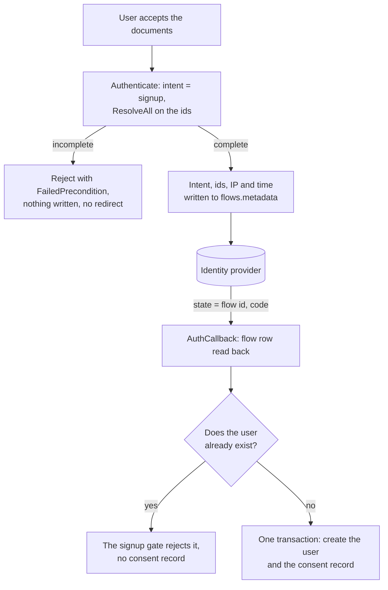

# RFC 0002: Explicit consent at signup

| | |
|---|---|
| **Status** | Draft. Not implemented. |
| **Author** | Rohan Chakraborty |
| **Created** | 2026-08-26 |
| **Updated** | 2026-08-27 |

## Summary

Frontier can make a user accept a set of documents before their account is created, and store one
consent record for it.

A deployment lists its documents in server config with an id, title, version and URL. The client
sends the document ids the user accepted. Frontier checks the ids cover every document in config,
then creates the user and the consent record together. The record lists each accepted document
with the version and URL from config.

Consent belongs to a signup, and frontier cannot currently tell a signup from a login. Both are the
same request, and a login creates the account it should have refused. So this RFC also adds a flow
intent that separates the two, which is what lets the consent check run before the browser leaves
for the identity provider.

If `app.consent` is not enabled, nothing changes. Frontier never parses document contents or
version strings.

## Problem

Frontier creates a user at the end of a registration flow and stores nothing about what the user
agreed to.

Finishing signup is the only evidence of agreement. A record built from that only says the user
signed up, which we already know. It cannot tell apart a user who read the documents from one who
never saw them.

There is nothing to show when someone asks which documents a user accepted, and when.
`users.metadata` does not work for this: `UpdateUser` and `UpdateCurrentUser` both replace the
whole map, so a user can delete their own consent by editing their profile, and the metadata goes
away with the user row.

Documents have versions, but nothing records which version a user accepted, so you cannot tell
which one applies to them.

And frontier does not know which requests are signups. `SignInView` and `SignUpView` are the same
view with different strings: both call `authenticate({ strategyName, callbackUrl })`, both hand
mail OTP to the same `MagicLinkView`, and only the title, the footer link and one `gap` value
differ. `AuthenticateRequest` carries no intent, `Flow` carries none, and every strategy ends at
`getOrCreateUser` (`core/authenticate/service.go:784`), which returns the existing user or creates
one. So logging in with an address that has no account creates it, through a view that never showed
the documents, and no client can ask for anything else.

## Goals

- The client sends consent explicitly. The server rejects signup when it is missing.
- No API can update or delete a consent record. Deleting the user does not delete it either.
- A consent record stores the version and URL of every document it covers.
- Document ids, titles, versions and URLs come from config. Frontier does not read them.
- A login never creates an account. A signup never silently logs an existing user in.
- One RPC and one callback, unchanged.
- Deployments that do not set or enable `app.consent`, and clients that send no intent, behave
  exactly as before.

## Non-goals

Re-consent, withdrawal, and users who already exist. When a document version changes, old consent
records keep pointing at the old version and nobody is asked again.

Repairing a missing consent record. A record is written when a user is created and at no other
time. There is no path that adds one to an account that already exists, and none for the three
paths that create a user without starting a flow, which Enforcement lists.

Making the login gate a security boundary, and hiding whether an address has an account. Both are
given up deliberately, and Limitations says what they cost.

Frontier does not host the document text and does not serve the document list. Clients keep their
own copy of the list. The SDK sign-up view gets a checkbox so it still works when consent is
enabled, but the copy, the links and any second checkbox are the consumer's.

## Document config

A map under `app.consent`, keyed by document id:

```yaml
app:
  consent:
    enabled: true
    documents:
      terms_of_service:
        title: Terms & Conditions
        version: "2026-04-01"
        url: https://example.org/legal/terms/2026-04-01
      privacy_policy:
        title: Privacy Policy
        version: "2026-04-01"
        url: https://example.org/legal/privacy/2026-04-01
```

`app.consent` sits next to `app.authentication` and `app.pat` on `server.Config`. A document has an
id, a title, a version and a URL, and nothing else. The example lists two; a deployment lists all of
its documents, and they have to be in config from the first release, for the reason below.

A map, not a list, for three reasons. It matches `authenticate.Config`, which already keys
`oidc_config` by strategy name. The map key is the document id, so two documents cannot use the
same one. And you can override a single field with an env var, which you cannot do for one item in
a list of objects.

There is no per-document `required` flag. Every document in the map is required at signup. A flag
would put two lists in config where one does the job, and an optional document is a different
feature that needs withdrawal. The cost is that adding a document id breaks signup for clients
still sending the old list, so a new document and the client release that sends it ship together.
Version bumps are unaffected, since the client only sends ids.

`version` is an opaque string that frontier only compares for equality, so a deployment can use
dates, semver or commit SHAs.

`enabled` is one switch for the whole feature. With `app.consent` absent or `enabled` false,
frontier behaves exactly as it does today: no check runs, no record is written, and
`accepted_document_ids` is ignored rather than rejected, so one client build works against both
kinds of deployment. With `enabled` true every document in the map is required, and `enabled` true
with no documents fails at boot instead of quietly turning the feature off.

Config is read once at boot, so changing a document version needs a restart. Keys are
env-overridable like the rest of frontier's config. An override cannot change an existing record,
since records are immutable and each holds its own copy of the version, but it can produce wrong
new ones, so the resolved document set is logged at boot. That log, not the config repo, tells you
what a deployment was actually serving.

Bad config fails at boot instead of at the first signup: document ids, versions and URLs must be
non-empty, URLs must parse, and an enabled block needs at least one document.

## The request fields

Two new fields on the existing `AuthenticateRequest`, authored in `raystack/proton` and generated
here through `PROTON_COMMIT`:

```proto
enum FlowIntent {
  FLOW_INTENT_UNSPECIFIED = 0;
  FLOW_INTENT_LOGIN       = 1;
  FLOW_INTENT_SIGNUP      = 2;
}

FlowIntent flow_intent = 6;
repeated string accepted_document_ids = 7;
```

Both fields are assigned in one proton PR, so neither can claim the other's number.

An enum rather than a string for the intent, because the set is closed. The zero value carries
backward compatibility for free: unspecified means today's behaviour, so no existing caller has to
change. `AuthCallback` needs neither field. Both ride in the flow.

The ids only ever accompany `FLOW_INTENT_SIGNUP`. Sent with a login intent they are a client bug
and the handler rejects them, since a login creates no user and writes no record. Dropping them
quietly would leave a client believing it had recorded a consent that does not exist.

Document ids, not a single boolean, because the client has its own copy of the list and the two can
go out of sync. With ids frontier sees the mismatch and rejects the signup. With a boolean it would
stamp whatever config holds and write a record saying the user accepted a document they were never
shown, with nothing to catch it. Ids also leave room for consenting to a subset later.

Ids and nothing else. The client never sends versions, titles or URLs, and frontier would not use
them if it did, since everything on a consent record is stamped from config. Duplicate ids are
de-duplicated before the check.

## Carrying them across the redirect

In an OIDC flow the user accepts the documents before the browser leaves for the identity
provider, and the account is created after it comes back:



The only thing that survives the redirect is `state`, which already holds the flow id and is
visible to the browser and the provider. So both fields go where the flow id points.
`Flow.Metadata` is a JSONB column that already carries `callback_url`, so nothing needs a
migration. `RegistrationStartRequest` gains the intent and the ids, `core/authenticate` gains the
type, and `StartFlow` writes two more keys:

```go
type FlowIntent string

const (
    FlowIntentUnspecified FlowIntent = ""
    FlowIntentLogin       FlowIntent = "login"
    FlowIntentSignup      FlowIntent = "signup"
)

flow.Metadata["intent"] = string(intent)
flow.Metadata["consent"] = map[string]any{
    "accepted_document_ids": ids,
    "ip_address":            ip,
    "at":                    s.Now(),
}
```

The flow row is written before the redirect and read after it comes back, so neither value goes
through the browser and neither can be changed on the way. The IP and time stored are from when
the user accepted, not from the callback. Mail OTP and passkey use the same path, so there is one
code path for every strategy.

`Authenticate` and `AuthCallback` are both in `authenticationSkipList`, so the authentication
interceptor does not run and nothing puts session metadata in the context. The `Authenticate`
handler has to call `sessionutils.ExtractSessionMetadata` itself and pass the IP into `StartFlow`.
That helper returns `session.SessionMetadata`, whose `IpAddress` is the leftmost value of the
configured client IP header. It parses the user agent into an OS and a browser family and drops the
raw string, which is why the record keeps only the IP.

`Flow.Metadata` is `map[string]any` stored as JSONB, so it does not return the types it was given:
the ids come back as `[]any` and `at` as an RFC 3339 string. One typed accessor per key handles the
read, the way `otpAttempts` already does for the attempt counter, rather than an unchecked
assertion like `flow.Metadata["callback_url"].(string)`. Both accessors are methods on `*Flow` and
are nil-receiver safe, returning `FlowIntentUnspecified` and no consent, so a caller with no flow
needs no branch of its own. A missing or unparseable consent key counts as no consent.

This also fixes something unrelated. `applyOIDC` never calls `consumeFlow`, so OIDC flow rows sit
around until the expiry cron while mail OTP rows are deleted on use. That is hard to justify once
those rows hold consent.

## Enforcement

Two gates. `StartFlow` is the fast path and exists for the error message. User creation is the gate
that matters: it is the only point every strategy reaches, and it is where the account would
otherwise be created. OIDC does not know the email until the callback, which is why the login gate
needs both points.

### Login and signup

| Intent | Strategy | At `StartFlow` | At user creation |
|---|---|---|---|
| login | mailotp, passkey | reject if no user exists | reject if no user exists |
| login | oidc | email unknown, no check | reject if no user exists |
| signup | mailotp, passkey | reject if a user exists | reject if a user exists |
| signup | oidc | email unknown, no check | reject if a user exists |
| unspecified | all | no check | create or get, as today |

`StartFlow` guesses signup from login for passkey by looking the user up
(`core/authenticate/service.go:220`), and `finishPassKeyLoginMethod` calls `getOrCreateUser`, so a
passkey login can create an account today. The intent replaces the guess: signup picks
`startPassKeyRegisterMethod`, login picks `startPassKeyLoginMethod`, and unspecified keeps the
guess so nothing existing breaks.

### Consent

The consent service owns the config, so it owns both checks. They are separate functions because
signup and any later use want different rules:

```go
// Resolve maps ids to their config snapshots. Rejects unknown ids.
// Says nothing about whether the set is complete.
func (s Service) Resolve(ids []string) ([]Document, error)

// ResolveAll is Resolve plus the completeness rule: the ids must cover
// every document in config, no more and no less.
func (s Service) ResolveAll(ids []string) ([]Document, error)

// Grant writes one consent record for the documents given.
// No completeness rule here at all.
func (s Service) Grant(ctx context.Context, tx *sqlx.Tx, req GrantRequest) error
```

`ResolveAll` compares the two sets in both directions, so the error names what is wrong: which
required ids are missing, or which sent ids config does not know. `Grant` takes whatever it is
given, which is what leaves room for a later re-consent covering one document without a second
write path.

The intent decides where the completeness check runs.

With `FLOW_INTENT_SIGNUP` the `Authenticate` handler knows a signup when it sees one, so
`ResolveAll` runs there, before the browser leaves for the provider and before mail OTP sends
anything. An incomplete set is rejected with nothing written and no redirect. This holds for every
strategy, OIDC included: the email is still unknown at flow start, but the intent is not.

With the intent unset, a signup and a login look like the same request, so the check splits.
`Resolve` at flow start catches an unknown id before the redirect, and `ResolveAll` runs at user
creation, the first point where frontier knows the user is new. An unset intent is permissive for
the login gate but not for this one: `ResolveAll` still has to pass before a user row is written,
so omitting the intent skips the login gate and not consent.

`ResolveAll` runs again at user creation either way. Not for the error, which under a signup intent
has already been returned, but as the invariant guarding the write. It is the last point before the
insert, and it is what makes a user row without a consent record impossible however the flow
reached it.

`getOrCreateUser` takes the flow, which is a signature change. The flow carries both the intent
and the consent, so one parameter serves both gates, and the nil-safe accessors mean
`authenticateWithPassthroughHeader`, which has no flow, passes nil and needs no branch of its own.
Then:

- New user, `ResolveAll` passes: one transaction creates the user row and the consent record.
- New user, `ResolveAll` fails: return `ErrConsentRequired` and create nothing.
- Existing user: write nothing. Under a signup intent the login gate has already rejected the
  request; under an unset intent they are logged in, whatever the flow holds.

The third case is absolute. A record written outside a user creation would carry that moment's
timestamp and IP for an agreement that happened somewhere else, which is worse than having no
record: it reads like real evidence.

That is why the transaction matters. `ResolveAll` runs before the transaction opens, so an
incomplete payload never starts one. Inside it, the user insert and the consent insert either both
land or neither does; without it a failed consent insert would leave an account with no record and
nothing able to repair it, which is the gap this feature exists to close. `pkg/db` has `WithTxn`
but no context-carried transaction, so both repositories need a `Create` that accepts the
`*sqlx.Tx`. That is additive and breaks no existing caller. If threading it through the user
repository is rejected, the fallback is to delete the user row when the consent insert fails and
log loudly if that delete also fails.

### Errors

Three errors alongside the existing block at `core/authenticate/service.go:53`:

```go
ErrLoginUserNotFound = errors.New("no account for this email")
ErrSignupUserExists  = errors.New("an account already exists for this email")
ErrConsentRequired   = errors.New("consent required for the configured documents")
```

They map to `CodeNotFound`, `CodeAlreadyExists` and `CodeFailedPrecondition`, returned from both
`Authenticate` and `AuthCallback`. `AuthCallback` maps a fixed list of errors to `InvalidArgument`
and everything else to `Internal` (`internal/api/v1beta1connect/authenticate.go:117`), so all
three have to be added to that list or they surface as 500s. `FailedPrecondition` is what lets a
client tell a consent rejection apart from a bad code or an expired flow and ask again.

A rejection ends the flow. Under a signup intent it happens at `Authenticate`, before an OTP goes
out or a redirect is issued, so the user retries and loses nothing. Under an unset intent a consent
rejection happens at user creation, and for mail OTP that means a fresh code, since `applyMailOTP`
calls `consumeFlow` before it creates the user. Either way, reusing the flow would only let the
same client assert the same wrong set again.

### The other paths that create users

`getOrCreateUser` has five callers, and two paths create a user row without going through it at all:

| Path | With consent enabled |
|---|---|
| `applyOIDC` | gated: the flow carries the consent |
| `applyMailOTP` | gated: the flow carries the consent |
| `finishPassKeyRegisterMethod` | gated: the flow carries the consent |
| `finishPassKeyLoginMethod` | gated: a first-time passkey login is a signup |
| `authenticateWithPassthroughHeader` | not gated: no flow exists |
| `organization.Service.AdminCreate` | not gated: operator action, no flow |
| `CreateUser` RPC | not gated: operator action, no flow |

The four flow-based paths are the ones a person signs up through, and they are the ones this RFC
closes. The other three are exempt because no account holder is present to consent:
`authenticateWithPassthroughHeader` provisions from `app.identity_proxy_header`, which already
warns that it bypasses authorization, and `AdminCreate` and `CreateUser` are operator actions.

Exempt means those accounts get no consent record, the same as users who already exist. A
deployment that wants full coverage keeps all three out of its signup path: `identity_proxy_header`
unset outside development, and the two operator RPCs used only for accounts nobody signs up for.
Limitations records the residual gap.

## Storage

One consent record per consent, listing the documents it covers.

```sql
CREATE TABLE user_consents (
    id           UUID PRIMARY KEY DEFAULT uuid_generate_v7(),
    user_id      UUID        NOT NULL,
    user_email   TEXT        NOT NULL,
    documents    JSONB       NOT NULL,
    source       TEXT        NOT NULL DEFAULT 'signup',
    auth_method  TEXT,
    ip_address   TEXT,
    consented_at TIMESTAMPTZ NOT NULL,
    created_at   TIMESTAMPTZ NOT NULL DEFAULT NOW(),
    metadata     JSONB       NOT NULL DEFAULT '{}',

    CONSTRAINT documents_not_empty CHECK (
        jsonb_typeof(documents) = 'array' AND jsonb_array_length(documents) > 0
    )
);

CREATE UNIQUE INDEX uq_user_consents_signup
    ON user_consents(user_id) WHERE source = 'signup';

CREATE INDEX idx_user_consents_documents
    ON user_consents USING GIN (documents jsonb_path_ops);
```

`documents` holds one object per accepted document, copied from config at write time:

```json
[
  {
    "id": "terms_of_service",
    "title": "Terms & Conditions",
    "version": "2026-04-01",
    "url": "https://example.org/legal/terms/2026-04-01"
  },
  {
    "id": "privacy_policy",
    "title": "Privacy Policy",
    "version": "2026-04-01",
    "url": "https://example.org/legal/privacy/2026-04-01"
  }
]
```

Four fields per document, the same four config holds. A field added later appears on new records
only, since old ones keep the shape they were written with.

`metadata` is written once at insert like every other column and is empty today. It gives a later
re-consent somewhere to record its own context without a migration. Nothing reads it.

The grain is the consent, not the document. A user accepts a set in one act, so `user_email`,
`ip_address` and `consented_at` describe the act and are stored once, and the document list is an
argument to the write rather than something the schema fixes, which is what covers a later
re-consent for any subset. Alternative 3 has the tradeoff.

Four things in there are deliberate and look like mistakes otherwise.

There is no foreign key to `users`. `UserRepository.Delete` does a hard `DELETE`, so
`ON DELETE CASCADE` would drop the consent records and `ON DELETE RESTRICT` would block account
deletion. Records have to survive the user, which is also why `user_email` is denormalized: once
the user row is gone there is nothing left to join to. `ip_address` is `TEXT` and nullable, not
`INET`, because the value comes from a request header and a bad or absent one must not fail a
signup.

The document versions and URLs are copies, not references. A consent record has to stay readable
years later and stay correct after the document is dropped from config. It is also why a document
table can be added later with no backfill: no consent record points at one.

The unique index means a user gets at most one signup consent. Since nothing repairs a record, a
second signup write for the same user is a bug, and this makes it fail instead of leaving two rows
disagreeing about what happened.

Consent records cannot be changed. A `BEFORE UPDATE` and a `BEFORE DELETE` trigger both raise
`45000`, following `20250904105226_add_audit_records_immutability.up.sql`, which does the same for
`audit_records`. That migration guards only `UPDATE`; `DELETE` is guarded here too, because a
deleted consent record leaves a user who looks like they never consented. The repository has
`Create` and nothing else, so no admin API path reaches a record even if a trigger gets dropped.
`DROP TABLE` still works, so `migrate down` is fine.

A signup also writes one audit record so the audit trail shows it happened. `pkg/auditrecord` gains
`UserConsentGrantedEvent Event = "user.consent_granted"` and `ConsentType EntityType = "consent"`,
following the `entity.verb` naming already there. Every field is set explicitly:

| Field | Value |
|---|---|
| `Actor` | the new user: its id, `app/user`, email as name |
| `Resource` | the same user |
| `Target` | the consent record id, `consent` type, document ids and versions in `Metadata` |
| `OccurredAt` | `consented_at` from the flow, not the write time |
| `OrgID`, `IdempotencyKey` | empty. Both are nullable, and a signup has no org |

`Actor` cannot be left to enrichment, and this is the part that looks fine and is not.
`AuditRecordRepository.Create` calls `enrichActorFromContext` when the actor is empty, and nothing
puts an actor in the context of a skip-listed endpoint, so the record would land with `uuid.Nil` and
the `system` actor for an act a person performed. Going through `auditrecord.Service.Create`
instead is worse: its `enrichUserActor` reads `Actor.ID` as a session id and resolves the user from
`session.UserID`, and no session exists yet, so it returns `ErrActorNotFound`. So the write goes
through the repository with the actor filled in, the way `userpat` writes its PAT events.
`actor_id` is `UUID NOT NULL` and the user id exists by then, because the row is already committed.

The write happens after the transaction commits, since `Create` has no `*sqlx.Tx` variant, so it
cannot be atomic with the consent record. That is why the consent record is the source of truth: if
the audit write fails, log it and carry on.

## Reading it back

There is no read API and no view. A reporting tool points at `user_consents` and reads the rows as
they are. A record is self-contained, so "what did this user accept, and when" is one row. The
reverse, "who accepted privacy policy 2026-04-01", is a containment filter:

```sql
SELECT user_email, consented_at, ip_address
FROM user_consents
WHERE documents @> '[{"id": "privacy_policy", "version": "2026-04-01"}]';
```

`@>` is what the GIN `jsonb_path_ops` index on `documents` serves, so that filter uses the index. A
view would be one more object to keep in step with the table it summarizes.

## Client

Three files under `web/sdk/client/views/auth`, which are the only callers of `authenticate` in the
repo. `sign-up/sign-up-view.tsx` sends signup on the OIDC buttons, `sign-in/sign-in-view.tsx` sends
login, and `magic-link/magic-link-view.tsx` is shared by both, so it takes the intent as a prop.

Neither sends document ids, so with consent enabled the shipped sign-up view cannot complete a
signup. It gets an Apsara `Checkbox`:

```tsx
export type SignUpViewProps = /* ... */ & {
  consent?: {
    documentIds: string[];
    label?: ReactNode;
  };
};
```

The prop is optional and the checkbox renders only when it is passed, so a deployment with consent
disabled sees the view it sees today. When it is passed the checkbox starts unchecked, every
sign-up control stays disabled until it is checked, and `documentIds` goes out as
`accepted_document_ids`. `MagicLinkView` takes the ids alongside the intent, so both strategies go
through one control.

`label` takes a `ReactNode` so the consumer supplies the copy and the links. The default is plain
text without links, since the SDK does not know the documents or their URLs, and `documentIds`
comes from the consumer for the same reason. It is the duplication Limitations describes, now
visible in a prop. A second checkbox or a per-document link is a consumer rendering its own view
and calling `authenticate` directly, which already works today.

`magicLinkHandler` handles only `status === 400` today and writes the message into the email field.
It needs the three new codes, with copy that points at the other view for the two gate errors;
`config.redirectSignup` and `config.redirectLogin` already exist for the links.

The OIDC rejections arrive at `AuthCallback`, which is the callback page rather than the view that
started the flow, and that page has no error UI. Redirecting back to the originating view with an
error param is the smaller change, rendering it in place is the other option, and this is undecided.

## Alternatives considered

1. Consent in `users.metadata`. Both update paths replace the whole map, so a user can delete
   their own consent record, and it goes away with the user row.

2. Consent in `audit_records`. `CreateAuditRecord` takes any event string with a client-supplied
   `occurred_at`, gated on platform `check`, which both the admin and member relations grant. Any
   platform member could insert a backdated consent record. A table with no write RPC can only be
   written by the signup path.

3. One row per accepted document instead of one per consent. It puts every field in a column, but
   it repeats the email, IP and timestamp on every row, and it needs a synthetic event id to answer
   "what did this user accept in one sitting" once there is more than one occasion. The act is what
   is being recorded, so the act is the row.

4. The documents in the database instead of config, whether as a plain `consent_documents` table,
   a `ConsentDocument` reconcile kind or an RPC serving the list. Each consent record already
   copies its document versions, so the records are the version history and a table answers no
   query they cannot. Config sits in git, which is a better change log than rows an admin can
   edit, and any of the three needs a write path, which is one more way to change what the server
   stamps. A deployment that wants one source of truth can generate both the config block and the
   client's copy from a single file. Future work has the conditions under which this is revisited.

5. Taking consent in `AuthCallback`. The client would have to stash it locally and resend it after
   the redirect, so the consent record would attest to a client re-assertion made after the fact,
   the IP would be the post-redirect one, and it would break when the provider comes back into a
   different tab.

6. Repairing a missing consent record on a later login. See Enforcement.

7. Two RPCs, `Login` and `Signup`, instead of the intent. `AuthCallback` cannot be split alongside
   them: `state` is the flow id, both gates run at callback time, and two callback URLs would have
   to be registered with every provider. The intent would still have to ride on the flow, so the
   split duplicates the entry point without moving either gate, and leaves `Authenticate` as a
   permanent ungated path since no existing caller can be broken. Frontier already discriminates
   strategies with `strategy_name` on one RPC.

8. A `oneof` carrying a `LoginIntent` and a `SignupIntent` message, with the accepted ids on the
   signup arm only. It makes a signup-only field unrepresentable on a login rather than merely
   rejected, and there is precedent in `ChangeSubscriptionRequest.Change`. But
   `AuthenticateRequest.email` is already a field only some strategies use, checked at runtime, so
   the flat field is the shape this message has. Moving later means deprecating field 6 and
   carrying both for a window, so adopt it now if more signup-only fields are expected.

9. Enforcing the login gate only at user creation, or accepting the flow and failing at
   verification without sending anything. Both keep `Authenticate` quiet about whether an address
   has an account. The first costs a wasted OTP mail and puts "no account for this email" on the
   verification screen, where it reads like a bad code; the second wastes nothing but leaves the
   user waiting for a code that never arrives. The clearer error was chosen over the quieter
   endpoint.

10. A first-class `Intent` field on `Flow`. It types better than metadata and costs a migration on
    `flows` for one string, when the consent payload has to go in `metadata` regardless.

## Limitations

Changing a document version needs a redeploy, since config is read at boot.

The client's document list and the server's are declared separately and can go out of sync. Ids
catch a set mismatch. A version mismatch is undetectable, since the client sends no versions: a
client showing version A against a config holding version B produces a record that says B. Only
frontier serving the list would close that.

A record ties to a version string, not to the document text. Editing the file at a URL without
bumping the version leaves every record for that version describing something the user did not see.
A per-document hash would close it and can be added later, since a document object is just JSON.

The IP is only as good as the header it comes from. A proxy that appends to `X-Forwarded-For`
instead of overwriting it leaves the value under the caller's control, and a deployment that does
not set the header at all gets records with no IP.

Users who already exist get no consent record, and nothing will ever give them one, so you never
get to full coverage. Neither do users created through the three exempt paths under Enforcement.
"No account without consent" holds for the signup flow, not for every row in `users`, and a
deployment has to accept that distinction before it relies on the records.

The unauthenticated `Authenticate` endpoint now answers whether an address has an account, for
mailotp and passkey where the email is known at flow start. Frontier does not answer that today,
because it auto-provisions instead. Rate limiting per address and per IP is the mitigation, not
hiding the answer. Passkey already leaks existence through its response shape, since register and
login return different options, and the intent neither widens that nor closes it.

The login gate is a UX boundary and not a security one: an unset intent keeps create-or-get, so any
client can opt out by omitting the field. Consent cannot be opted out that way, since `ResolveAll`
runs at user creation under every intent.

Sharing a transaction with the user insert means the user repository gains a create that takes a
transaction. It is additive, but it is the one place this feature reaches outside its own domain.

## Future work

Re-consent when a document version changes. The write path already handles it: `Grant` takes the
document list as an argument and `source` separates one occasion from another. What is missing is
enforcement, which has to move from user creation to a gate on authenticated requests, roughly
what Keycloak's terms and conditions required action does. That is its own feature.

A server switch that rejects an unset intent, which turns the login gate into a boundary. It needs
a deprecation window first, since it breaks every client that has not moved.

A document list endpoint, if clients keeping their own copy turns out to be too fragile.
`ListAuthStrategies` is unauthenticated and already fetched by the sign-in page, so the resolved
document set could ride along on it instead of needing a new RPC, and the SDK sign-up view could
render the documents rather than be handed their ids.

A per-document hash in config, copied into the record, to tie a consent to the document text and
not to a version string someone typed into config.

A `ConsentDocument` reconcile kind, if restarts become a problem. It needs list and write RPCs and
a `consent_documents` table keyed by `(document_id, version)`. The config map maps onto that
directly and nothing needs backfilling, since no consent record points at it.

Withdrawal, which needs a decision on what happens to the account.

A reserved-event guard on `CreateAuditRecord`, so events frontier writes itself cannot be injected
through the public RPC. Any platform member can forge a backdated `user.consent_granted` through
it, the same way they can forge `pat.revoked`. That does not weaken `user_consents`, which has no
write RPC, but it does mean the audit record is a breadcrumb and not evidence.

## Work in order

1. proton PR adding `FlowIntent`, `flow_intent = 6` and `accepted_document_ids = 7` in one change.
2. Bump `PROTON_COMMIT` in `Makefile:7` and run `make proto`.
3. Core, the login gate first: the `FlowIntent` type, the request fields, the metadata write and
   the nil-safe accessors, the `StartFlow` checks, the passkey branch, and the `getOrCreateUser`
   signature.
4. Core, consent: `app.consent` with boot validation, the consent service, the migration and
   repository, and the transactional write in `getOrCreateUser`.
5. Handlers: the intent and ids into `StartFlow`, `ExtractSessionMetadata` in `Authenticate`, and
   the three errors mapped in both `Authenticate` and `AuthCallback`.
6. SDK: the intent and ids through `MagicLinkView`, both views, the checkbox, and the error copy.
7. Tests. `core/authenticate/service_test.go` covers three intents against an address that does and
   does not have an account, at both enforcement points, plus one case per strategy, since OIDC,
   mail OTP and both passkey methods reach `getOrCreateUser` by different routes. Consent adds the
   complete, incomplete and unknown-id sets, and a consent insert failure rolling back the user
   row.

## References

- [RFC 0001: Declarative management of platform resources](0001-declarative-reconcile.md), for the
  reconcile flow mentioned above.
- ISO/IEC 29184:2020, *Online privacy notices and consent*, and the Kantara Consent Receipt
  specification, which the field list follows.
- RFC 9126, *OAuth 2.0 Pushed Authorization Requests*, for keeping request data server-side behind
  a handle.
- Digital Personal Data Protection Act, 2023, section 6(1), for the "clear affirmative action"
  standard.
